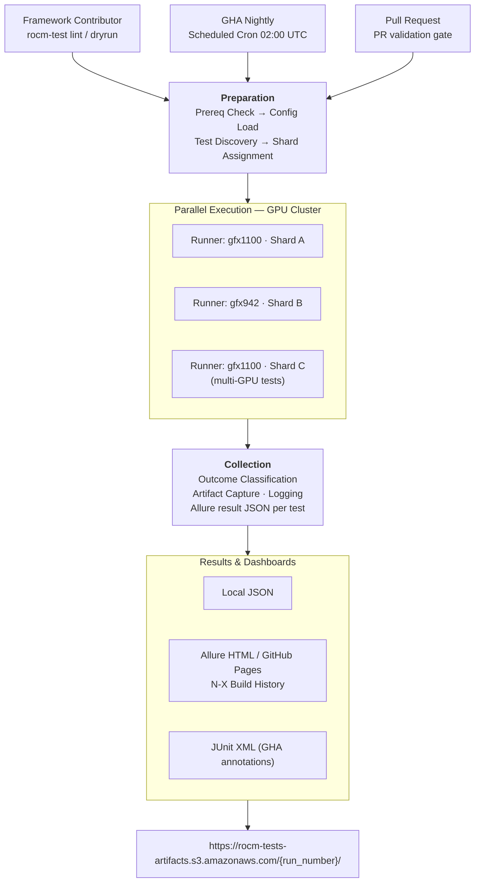

# ROCm System E2E Test Automation Framework

A modular, pytest-based test automation framework for validating the AMD ROCm GPU software stack as an integrated system — spanning the kernel driver and HIP runtime through compute libraries, profiling tools, and third-party ML frameworks.

A single, governed framework covering the full test spectrum - functional e2e and non-functional scenarios (performance, resiliency and endurance), with platform agnostic design that runs identically on Linux and Windows. Native integration with TheRock CI enables zero-touch test triggers on public GitHub Action runners with results. Built-in agentic AI lets contributors create new test cases, update or extend existing tests, and review test quality before committing - providing a fast path from intent to taxonomy-compliant, CI-ready tests.

---

## Design Principles

### Modular, Plugin Architecture

> *The framework and your tests are independent by design.*

Framework capabilities — GPU management, health gates, artifact collection, retry logic, and reporting — live in discrete pytest plugins loaded via `conftest.py`. Test files contain only test logic; they import nothing from the plugin layer directly. This clean separation means teams can bring their own test libraries without touching framework internals, new capabilities can be added orthogonally without modifying existing tests, and the same test file runs unchanged across local, SSH, container, or DryRun execution environments. The executor abstraction (`local`, `ssh`, `container`, `dry_run`) makes the execution target a configuration choice, not a code decision.

### Unified Test Framework

> *One framework, every test category.*

A single framework covers the full test spectrum: functional end-to-end validation, performance regression (per-GPU-architecture YAML baseline comparison with configurable tolerance thresholds), resiliency and hang recovery (graduated device reset → driver reload → node reboot), and multi-hour endurance and soak tests — all under the same marker taxonomy, reporting pipeline, and CI orchestration. Contributors don't maintain separate toolchains for different test types; the framework adapts to the workload while preserving consistent governance and observability across all categories.

### CI Ready

> *Tests reach CI the moment they are pushed — no workflow edits required.*

DryRun mode (`--no-gpu`) and agentic AI authoring (`/new-test`, `/check-test`) let contributors validate and review test logic on any laptop before accessing shared GPU runners. Once pushed, marker dimensions (`ci.*`, `hw.*`, `layer.*`) automatically slot the test into the correct CI tier and runner — `ci.pr` tests run on every pull request, `ci.nightly` on the scheduled GPU cluster — with zero changes to workflow YAML. An optional, workflow-driven test matrix lets contributors influence execution scope purely through marker selection. `MarkerLinter` enforces taxonomy at write time so governance violations are caught before CI, not during review.

### Execution Efficiency & Predictability

> *Maximize GPU utilization. Eliminate ambiguous failures.*

Smart Sharding uses a Longest Processing Time (LPT) algorithm with VRAM-aware weights to distribute tests across available GPU devices automatically, saturating the cluster without over-provisioning. Every test outcome maps to a discrete result — `PASS / FAIL / TIMEOUT / KILLED / HEALTH_FAIL / PERF_DROP / REGRESSION` — rather than a binary pass/fail, so hardware faults, performance regressions, and test logic failures are distinguishable at a glance without manual log triage. The built-in retry harness captures kernel module lists, GPU state dumps, and execution traces on each attempt, making any failure sequence fully reconstructable from the Allure dashboard.

---

## Quickstart

### Prerequisites

- Python 3.10 or later
- Git
- AMD GPU hardware *(optional — DryRun mode works without one)*

### Step 1 — Clone and install

```bash
git clone https://github.com/ROCm/rocm-tests.git
cd rocm-tests
python3 -m venv .venv && source .venv/bin/activate
pip install -r requirements-dev.txt

# Faster install with uv (optional)
uv pip install -r requirements-dev.txt
```

### Step 2 — Run against real GPU hardware

```bash
# Smoke suite — fast PR-gate tests on real GPU
pytest tests/e2e/ -m "hw.gpu and ci.pr" -v

# Full nightly matrix for a specific architecture
pytest tests/e2e/ -m "hw.gpu and ci.nightly" --gpu-arch gfx942 \
  --alluredir=build/allure-results -v
```

**Common pytest flags:**

| Flag | Effect |
|---|---|
| `-m "<expression>"` | Select by marker (`hw.gpu and ci.pr`, `not hw.gpu`) |
| `-k "<name>"` | Further filter by test name or keyword |
| `--no-gpu` | Activate DryRun mode (no GPU required) |
| `--collect-only -q` | Preview matched tests without running them |
| `-x` | Stop after the first failure |
| `--tb=short` / `--tb=long` | Control traceback verbosity |
| `--alluredir=<path>` | Write Allure result JSON for dashboard generation |
| `-v` / `-q` | Verbose / quiet output |

---

## Onboarding a New Test

### Where to place your file

```
tests/e2e/<layer/category>/test_<feature>.py
```

Match the layer directory to the `layer.*` marker you intend to use:

| Directory | Marker | ROCm Layer/Category |
|---|---|---|
| `stack_validation/` | `layer.runtime` | HIP runtime, device enumeration |
| `compiler/` | `layer.runtime` | hipcc compilation, kernel execution |
| `multi_gpu/` | `layer.math_lib` | RCCL collectives, multi-GPU ops |
| `ml_frameworks/` | `layer.ml_framework` | PyTorch on ROCm |
| `recovery/` | `layer.driver` | GPU hang recovery |
| `debug_stack/` | `layer.debug_stack` | rocgdb sessions |


### Marker dimensions in Tests (required vs optional)

| Dimension | Required | Values |
|---|---|---|
| `hw.*` | **YES** | `gpu`, `multi_gpu`, `cpu_only` |
| `ci.*` | **YES** | `pr`, `nightly`, `weekly`, `smoke_e2e` |
| `layer.*` | **YES** | `driver`, `runtime`, `math_lib`, `ml_framework`, `debug_stack` |
| `runtime.*` | no | `fast` (<5 min), `medium` (<30 min), `longevity` (<2 hr), `soak` (hours) |
| `os.*` | no | `linux`, `windows`, `wsl`, `both` |
| `e2e.*` | no | `stack`, `multinode`, `app`, `upgrade` |


### AI-assisted authoring (optional)

Open Claude Code in the repo root and use the built-in skills:

```bash
claude
```

```
/new-test
> Validate that hipGetDeviceCount returns at least 1 on a gfx942 node
```

The agent generates a taxonomy-compliant, fixture-wired test file. Run `/check-test <file>` before opening a PR for a four-persona review. 
NOTE: These features will be evolved soon after base framework is established.

---

## Directory Structure

```
rocm-tests/
│
├── conftest.py                         # Root pytest entry point; loads all framework plugins
│
├── framework/                          # Core framework — imported by tests, never test files themselves
│   ├── config/
│   ├── common/
│   ├── executors/                      # Execution backends — swap without changing test code
│   ├── gpu/
│   ├── markers/
│   ├── os_adapter/                     # Unified Linux/Windows GPU enumeration interface
│   ├── plugins/                        # pytest plugins auto-loaded via conftest.py → pytest_plugins
│   ├── reporting/
│   ├── results/
│   └── sharding/
│
├── tests/                              # All test files; mirrors the ROCm stack layer hierarchy
│   ├── conftest.py                     # Test-level fixtures: mock_gpu_info, mock_ok/fail_result
│   ├── common/                         # Shared test utilities — NOT test files (excluded via norecursedirs)
│   ├── dry_run/                        # Config and framework tests — no GPU required (ci.pr)
│   └── e2e/                            # End-to-end tests against the full ROCm stack
│       ├── stack_validation/
│       ├── compiler/
│       ├── multi_gpu/
│       ├── ml_frameworks/
│       ├── recovery/
│       ├── debug_stack/
│       ├── upgrade/
│       └── performance/
│
├── docs/                               # MkDocs source — auto-deployed to GitHub Pages on merge
│
├── .github/workflows/                  # CI/CD — all workflows auto-triggered, no manual run needed
│   ├── pre-commit.yml                  # DryRun tests, lint, marker/matrix lint, MkDocs strict build
│   ├── e2e-nightly.yml                 # Full E2E across OSSI GPU cluster (gfx942, gfx1100, …)
│   ├── publish-reports.yml             # Allure N-X history merge → generate → GitHub Pages deploy
│   ├── security-scan.yml               # Bandit SAST + pip-audit CVE scan on every PR
│   └── docs.yml                        # Marker reference + test catalog → deploy docs site
│
├── rocm-test.toml                      # Primary config file (overrides code defaults; no secrets here)
├── pyproject.toml                      # Tool config: ruff, black, mypy, pylint, bandit, pytest
├── mkdocs.yml                          # MkDocs site config with mkdocstrings for API auto-docs
├── requirements.txt                    # Runtime dependencies
└── requirements-dev.txt                # Dev dependencies: lint, type-check, docs, test tools
```

---

## CI Trigger → Dashboard: Full Lifecycle

### High-Level Flow



### CI Workflows

| Workflow | Trigger | GPU Needed | Purpose |
|---|---|---|---|
| `pre-commit.yml` | Every pull request | No | DryRun tests, ruff, bandit, marker lint, MkDocs strict build |
| `e2e-nightly.yml` | Scheduled cron 02:00 UTC | Yes | Full E2E matrix across GPU cluster (gfx942, gfx1100, …) |
| `publish-reports.yml` | After nightly job | No | Allure N-X history merge → generate → deploy to GitHub Pages |
| `security-scan.yml` | Every pull request | No | Bandit SAST + pip-audit CVE scan |
| `docs.yml` | Merge to main | No | Auto-generate marker reference + test catalog → deploy docs |

---

## Contribution Guidelines
To be added later
