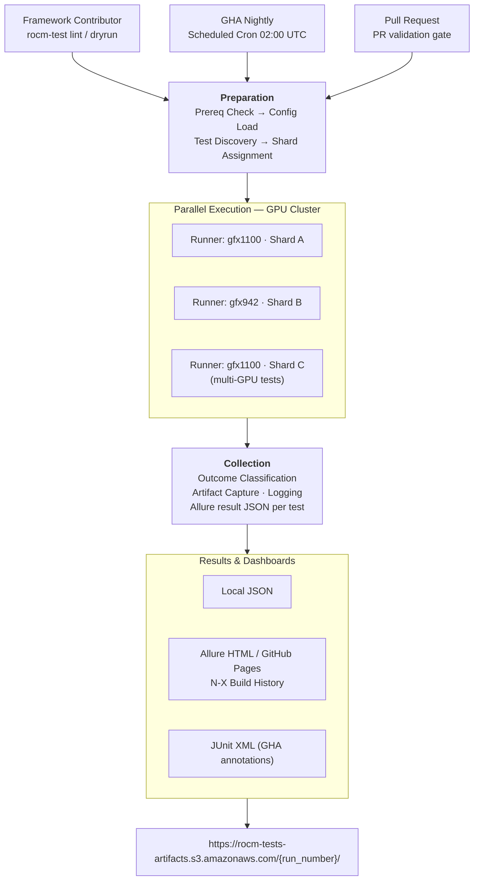

# ROCm System E2E Test Automation Framework

A modular, pytest-based test automation framework for validating the AMD ROCm GPU software stack as an integrated system — spanning the kernel driver and HIP runtime through compute libraries, profiling tools, and third-party ML frameworks.

A single, governed framework covering the full test spectrum - functional e2e and non-functional scenarios (performance, resiliency and endurance), with platform agnostic design that runs identically on Linux and Windows. Native integration with TheRock CI enables zero-touch test triggers on public GitHub Action runners with results. Built-in agentic AI lets contributors create new test cases, update or extend existing tests, and review test quality before committing - providing a fast path from intent to taxonomy-compliant, CI-ready tests.

---

## Design Principles

### Modular, Plugin Architecture

> *The framework and your tests are independent by design.*

Framework capabilities — GPU management, health gates, artifact collection, retry logic, and reporting — live in discrete pytest plugins loaded via `conftest.py`. Test files contain only test logic; they import nothing from the plugin layer directly. This clean separation means teams can bring their own test libraries without touching framework internals, new capabilities can be added orthogonally without modifying existing tests, and the same test file runs unchanged across local, SSH, container, or DryRun execution environments. The executor abstraction (`local`, `ssh`, `container`, `dry_run`) makes the execution target a configuration choice, not a code decision.

### Unified Test Framework

> *One framework, every test category.*

A single framework covers the full test spectrum: functional end-to-end validation, performance regression (per-GPU-architecture YAML baseline comparison with configurable tolerance thresholds), resiliency and hang recovery (graduated device reset → driver reload → node reboot), and multi-hour endurance and soak tests — all under the same marker taxonomy, reporting pipeline, and CI orchestration. Contributors don't maintain separate toolchains for different test types; the framework adapts to the workload while preserving consistent governance and observability across all categories. This unified scope extends equally to development and staging environments: the same framework, reporting pipeline govern pre-commit local validation, shared staging runners, and production GPU clusters — contributors do not switch toolchains or change test code as a workload moves from a development to production node.

### CI Ready

> *Tests reach CI the moment they are pushed — no workflow edits required.*

Enables shift-left validation: contributors run the full test suite on any development machine before touching a shared GPU runner, catching marker violations, fixture wiring errors, and logic regressions at the earliest possible stage. The framework enforces production quality test development practices — coding standards at pre-commit time, baseline fixtures enforce per-architecture performance contracts, and optional post-commit hooks. The in-built test retry harness captures deterministic artifact bundles on every failure so root-cause analysis is immediate rather than iterative. Marker dimensions (`ci.*`, `hw.*`, `layer.*`) automatically slot each test into the correct CI tier and runner the moment it is pushed — `ci.pr` tests execute on every pull request, `ci.nightly` on the scheduled GPU cluster — with zero edits to workflow YAML. Quality is gated at the initial stage of development.

The framework ships a curated set of agentic AI skills that give contributors a fully autonomous testing workflow. `/creator` generates a taxonomy-compliant, fixture-wired test file from a plain-language feature description or requirements document, handling marker resolution, fixture selection, and assertion structure automatically. `/refiner` applies a four-persona review to an existing test file, surfacing stability risks, coverage gaps, marker conflicts, and edge cases that manual review routinely misses. `/porter` migrates tests from external sources — shell scripts, raw Python, C++ gtest, or other frameworks — into fully compliant rocm-tests files, performing structured pattern substitution rather than a manual rewrite. Together these agents support the full test lifecycle: authoring from requirements, continuous quality validation, failure triaging through structured artifact analysis, and ingestion of tests from adjacent repositories or hardware bring-up scripts.

### Maximum Efficiency and Predictability

> *Maximize GPU utilization. Eliminate ambiguous failures.*

Dynamic Scheduling autodetects available GPU resources at session start, constructs a nodepool from discovered devices and their VRAM profiles, and distributes tests across the pool — ensuring GPU resources are never left saturated by over-provisioning or left idle by under-utilization. Every test outcome maps to a discrete result — `PASS / FAIL / TIMEOUT / KILLED / HEALTH_FAIL / PERF_DROP / REGRESSION` — rather than a binary pass/fail, so hardware faults, performance regressions, and test logic failures are distinguishable at a glance without manual log triage. The built-in retry harness captures kernel module lists, GPU state dumps, and execution traces on each attempt, making any failure sequence fully reconstructable from the Allure dashboard.

---

## Future Considerations

> *From deterministic validator to intelligent, adaptive testing ecosystem.*

The framework is designed to evolve. The current architecture — deterministic execution, governed markers, and structured artifact capture — provides the observability foundation that agentic systems require to act reliably. The next phase actively explores integrating Agentic AI across the full test lifecycle:

- **Predictive test selection** — Models trained on historical pass/fail signals, changed-file fingerprints, and GPU health metrics to surface the highest-risk tests first, shrinking feedback loops without sacrificing coverage.
- **Automated code review** — Agent-driven/Post-Hook commit analysis that enforces marker taxonomy, fixture correctness, assertion strength, and CI-gate placement before a PR is opened.
- **Flakiness profiling** — Continuous cross-run correlation of intermittent failures against GPU health signals, timing variance, and environmental drift to classify true flakes versus latent hardware degradation.
- **Automated root cause analysis** — Structured artifact bundles (GPU state dumps, kernel module snapshots, Allure traces) fed to an analysis agent that produces a ranked hypothesis list and links directly to the relevant framework code path.
- **Self-healing CI workflows** — Detect systematic failure patterns, propose targeted test updates, infrastructure remediations, and open draft PRs for human review — closing the loop from failure detection to corrective action without manual triage.

---

## Quickstart

### Step 1 — Clone and install

```bash
git clone https://github.com/ROCm/rocm-tests.git
cd rocm-tests
python3 -m venv .venv && source .venv/bin/activate
pip install -r requirements-dev.txt

# Faster install with uv (optional)
uv pip install -r requirements-dev.txt
```

### Step 2 — Run against real GPU hardware

```bash
# Smoke suite — fast PR-gate tests on real GPU
pytest tests/e2e/ -m "hw.gpu and ci.pr" -v

# Full nightly matrix for a specific architecture
pytest tests/e2e/ -m "hw.gpu and ci.nightly" --gpu-arch gfx942 \
  --alluredir=allure-results -v
```

**Common pytest flags:**

| Flag | Effect |
|---|---|
| `-m "<expression>"` | Select by marker (`hw.gpu and ci.pr`, `not hw.gpu`) |
| `-k "<name>"` | Further filter by test name or keyword |
| `--no-gpu` | Activate DryRun mode (no GPU required) |
| `--collect-only -q` | Preview matched tests without running them |
| `-x` | Stop after the first failure |
| `--tb=short` / `--tb=long` | Control traceback verbosity |
| `--alluredir=<path>` | Write Allure result JSON for dashboard generation |
| `-v` / `-q` | Verbose / quiet output |

---

## Onboarding a New Test

### Overview

Adding a test requires three things: a file placed in the correct `tests/e2e/` subdirectory, test specific marker decorators and test logic that calls a GPU operation through the framework's executor and asserts on a meaningful outcome. No framework internals need to be modified. No workflow YAML is touched. The marker set alone determines which CI runners pick up the test and when.

The framework is structured around a clean plugin boundary. All GPU management, health gates, retry logic, artifact collection, and reporting live in pytest plugins loaded automatically via `conftest.py`. Test files contain only test logic and declare resource requirements through markers — they never import from the plugin layer. A new test is typically a single file with a handful of decorators and one or two test functions.

**Minimal example:**

```python
@pytest.mark.layer.math_lib
@pytest.mark.hw.multi_gpu
@pytest.mark.gpu_count(2)       # acquire 2 GPUs from one node
@pytest.mark.gpu_vram(16)       # each GPU must have ≥ 16 GB free VRAM
def test_rccl_allreduce_2gpu(target_executor):
    """Verify RCCL AllReduce completes successfully on 2 GPUs."""
    result = target_executor.run("./build/rccl_allreduce --ngpus 2")
    assert result.ok
    assert "RESULT_OK" in result.stdout
```

That is the full surface area a contributor touches.
Use `@pytest.mark.gpu_count(N)` to declare how many GPUs the test needs and `@pytest.mark.gpu_vram(N)` to set a minimum VRAM threshold (in GB). 
The framework's nodepool filters eligible devices automatically — the test never sets `ROCR_VISIBLE_DEVICES` directly.

**Validate before opening a PR:**

```bash
# Confirm pytest discovers the test (no GPU required)
pytest tests/e2e/<layer>/test_<name>.py --collect-only -q --no-gpu

# DryRun: exercise fixture wiring without hardware
pytest tests/e2e/<layer>/test_<name>.py --no-gpu -v
```

### Where to place your file

```
tests/e2e/<layer/category>/test_<feature>.py
```

Match the layer directory to the `layer.*` marker you intend to use:

| Directory | Marker | ROCm Layer / Category |
|---|---|---|
| `compiler/` | `layer.runtime` | hipcc compilation, kernel execution, LLVM codegen |
| `concurrent_collectives/` | `layer.math_lib` | RCCL collectives, multi-GPU communication ops |
| `hwq_heuristic/` | `layer.runtime` | GPU hardware queue heuristics and scheduling behavior |


### Marker dimensions in Tests (required vs optional)

Each dimension is an independent axis of classification. A test carrying `hw.gpu`, `ci.nightly`, `layer.math_lib`, and `runtime.medium` is simultaneously a GPU test, a nightly-tier test, a math-library test, and a medium-duration test — these dimensions compose orthogonally, so any combination is a valid query with no special-casing required. As a test suite scales to thousands of tests across multiple GPU architectures, firmware versions, and ROCm releases, this orthogonality is what keeps execution control tractable: a single marker expression such as `hw.gpu and ci.nightly and layer.runtime` precisely selects the intended subset without enumerating individual test names or maintaining separate lists. CI workflows never need to be modified when a new test is added — the test's markers slot it into the correct runner and schedule automatically. The same mechanism drives Dynamic Scheduling: the `hw.*` dimension signals GPU slot requirements, `runtime.*` supplies duration weights for the LPT algorithm, and `gpu_count`/`gpu_vram` parametric markers allow the nodepool to pre-filter devices by capacity before any test begins — turning marker metadata into a live resource contract between the test and the infrastructure.

| Dimension | Required | Values |
|---|---|---|
| `hw.*` | **YES** | `gpu`, `multi_gpu`, `cpu_only` |
| `ci.*` | **YES** | `pr`, `nightly`, `weekly`, `smoke_e2e` |
| `layer.*` | **YES** | `driver`, `runtime`, `math_lib`, `ml_framework`, `debug_stack` |
| `runtime.*` | no | `fast` (<5 min), `medium` (<30 min), `longevity` (<2 hr), `soak` (hours) |
| `os.*` | no | `linux`, `windows`, `wsl`, `both` |
| `e2e.*` | no | `stack`, `multinode`, `app`, `upgrade` |

### AI-assisted authoring (optional)

Open Claude Code in the repo root:

```bash
claude
```

Three built-in agents support the full test authoring lifecycle:

| Command | Purpose |
|---|---|
| `/creator` | Generate a taxonomy-compliant test file from a feature description or requirements document |
| `/refiner <file>` | Apply a four-persona review — surfaces stability issues, coverage gaps, and marker conflicts |
| `/porter <source-file>` | Port a shell script, raw Python file, or external test into a framework-compliant pytest file |

**Example:**

```
/creator
> Validate that RCCL AllReduce completes in under 5 seconds on 2 GPUs with correct sum
```

The agent resolves marker dimensions, selects appropriate fixtures, and produces a complete, CI-ready test file. Run `/refiner` on the output before opening a PR.

---

## Directory Structure

```
rocm-tests/
│
├── conftest.py                         # Root pytest entry point; loads all framework plugins
│
├── framework/                          # Core framework — never imported directly by test files
│   ├── builder/                        # Binary compilation helpers (compile_binary fixture)
│   ├── common/                         # Shared utilities: ExecutionResult, parse_metric, Outcome
│   ├── config/                         # Config cascade: rocm-test.toml → env → CLI overrides
│   ├── executors/                      # Execution backends — local, SSH, container, dry_run
│   ├── gpu/                            # GPU enumeration, VRAM introspection, health checks
│   ├── markers/                        # taxonomy.py (MARKER_SCHEMA), MarkerLinter
│   ├── nodes/                          # Nodepool management: node_spec, gpu_file_lock, pending_tracker
│   ├── os_adapter/                     # Unified Linux/Windows GPU device path interface
│   ├── plugins/                        # pytest plugins auto-loaded via conftest.py → pytest_plugins
│   ├── reporting/                      # Allure result writing, metric attachment, outcome classification
│   ├── rocm/                           # ROCm-specific: version detection, library path resolution
│   │   └── libs/
│   └── scheduling/                     # Dynamic Scheduler: LPT algorithm, VRAM-aware shard assignment
│
├── tests/                              # All test files
│   ├── conftest.py                     # Test-level fixtures: mock_gpu_info, mock_ok/fail_result
│   ├── common/                         # Shared test utilities — NOT test files (excluded via norecursedirs)
│   ├── dry_run/                        # Config and framework tests — no GPU required (ci.pr)
│   └── e2e/                            # End-to-end tests against the full ROCm stack
│       ├── compiler/                   # hipcc compilation, LLVM codegen, kernel execution
│       ├── concurrent_collectives/     # RCCL collectives: AllReduce, Broadcast, multi-GPU ops
│       └── hwq_heuristic/              # GPU hardware queue heuristics and scheduling behavior
│
├── docs/                               # MkDocs source — auto-deployed to GitHub Pages on merge
│
├── .github/workflows/                  # CI/CD — all workflows auto-triggered, no manual run needed
│   ├── pre-commit.yml                  # DryRun tests, lint, marker lint, MkDocs strict build
│   ├── e2e-nightly.yml                 # Full E2E across GPU cluster (gfx942, gfx1100, …)
│   └── docs.yml                        # Marker reference + test catalog → deploy docs site
│
├── rocm-test.toml                      # Primary config file (overrides code defaults; no secrets here)
├── pyproject.toml                      # Tool config: ruff, black, mypy, pylint, bandit, pytest
├── mkdocs.yml                          # MkDocs site config with mkdocstrings for API auto-docs
├── requirements.txt                    # Runtime dependencies
└── requirements-dev.txt                # Dev dependencies: lint, type-check, docs, test tools
```

---

## CI Trigger → Dashboard: Full Lifecycle

### High-Level Flow



### CI Workflows

| Workflow | Trigger | GPU Needed | Purpose |
|---|---|---|---|
| `pre-commit.yml` | Every pull request | No | DryRun tests, ruff, bandit, marker lint, MkDocs strict build |
| `e2e-nightly.yml` | Scheduled cron 02:00 UTC | Yes | Full E2E matrix across GPU cluster (gfx942, gfx1100, …) |
| `security-scan.yml` | Every pull request | No | Bandit SAST + pip-audit CVE scan |
| `docs.yml` | Merge to main | No | Auto-generate marker reference + test catalog → deploy docs |

---

## Contribution Guidelines
To be added later
