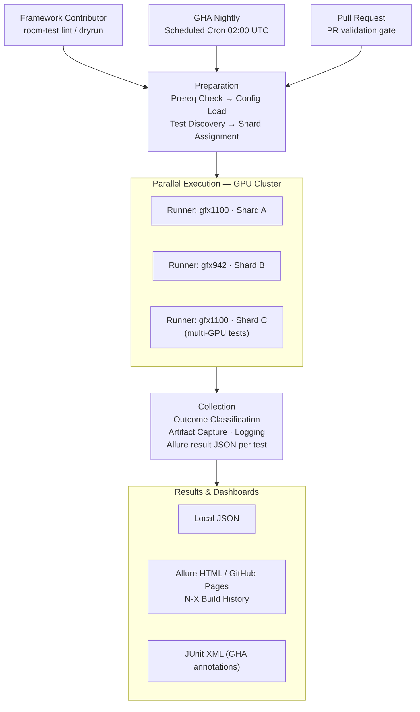

# Framework Architecture

This document is a deep-dive companion to the root README. It covers every framework capability in detail with annotated code examples, explains the internal execution pipeline, and provides role-specific workflows for each persona who contributes to or operates this framework.

---

## Table of Contents

1. [Architecture Overview](#architecture-overview)
2. [Framework Capabilities](#framework-capabilities)
   - [Multi-Environment Execution](#multi-environment-execution)
   - [GPU Device Management](#gpu-device-management)
   - [Multi-Dimensional Test Taxonomy](#multi-dimensional-test-taxonomy)
   - [Smart Sharding](#smart-sharding)
   - [Cross-Platform Support](#cross-platform-support)
   - [Test Harness: Retry & Artifact Capture](#test-harness-retry--artifact-capture)
   - [Agentic AI Test Authoring](#agentic-ai-test-authoring)
   - [Prerequisite Contract](#prerequisite-contract)
   - [Structured Observability & Reporting](#structured-observability--reporting)
   - [CI/CD Integration](#cicd-integration)
   - [Security & Compliance](#security--compliance)
   - [Performance Baselines & Regression Detection](#performance-baselines--regression-detection)
3. [User Persona Workflows](#user-persona-workflows)
   - [QA Engineer: Writing a New Test](#qa-engineer-writing-a-new-test)
   - [Automation Engineer: Extending the Framework](#automation-engineer-extending-the-framework)
   - [DevOps Engineer: Managing CI and Reporting](#devops-engineer-managing-ci-and-reporting)
   - [New Contributor: First Test in 15 Minutes](#new-contributor-first-test-in-15-minutes)
4. [Per-Test Execution Pipeline](#per-test-execution-pipeline)

---

## Architecture Overview

The framework is layered: the plugin stack sits between pytest and test files, so test code stays focused on the workload under test.

```
pytest invocation
    └── conftest.py (root)                   # Registers all framework plugins via pytest_plugins
            ├── framework/plugins/
            │       ├── gpu_plugin.py        # --no-gpu / --gpu-arch / --mock-gpu; gpu_fixture
            │       ├── health_plugin.py     # Pre/post health gates: temp, ECC, VRAM, clock
            │       ├── baseline_plugin.py   # Per-arch YAML baseline regression comparison
            │       ├── artifacts_plugin.py  # Auto-attach artifacts to Allure steps on failure
            │       ├── prereqs_plugin.py    # Session-level driver / ROCm version checks
            │       ├── retry_plugin.py      # --retry-count; per-attempt dump + trace capture
            │       └── reports_plugin.py    # Allure label mapping; outcome_fixture
            │
            └── framework/
                    ├── config/loader.py     # Config cascade: toml → env → CLI
                    ├── executors/           # local, ssh, container, privileged, interactive, dry_run
                    ├── gpu/                 # GpuDetector (KFD/amd-smi), GpuAllocator, MockGpuDetector
                    ├── markers/             # MARKER_SCHEMA taxonomy + AST-based MarkerLinter
                    ├── os_adapter/          # Unified Linux / Windows GPU enumeration
                    ├── reporting/           # AllureReporter: step(), attach_text(), report_metric()
                    ├── results/             # Outcome classifier: PASS/FAIL/TIMEOUT/HEALTH_FAIL/PERF_*
                    └── sharding/            # SmartShardManager: LPT algorithm, VRAM-aware
```

### Plugin Load Order

Every plugin is listed in `conftest.py → pytest_plugins`. Pytest loads them left-to-right before collecting tests. Because plugins are pure pytest hooks and fixtures, adding or removing a plugin has no effect on test files — they simply gain or lose the corresponding fixture and option.

---

## Framework Capabilities

### Multi-Environment Execution

The framework abstracts the execution environment through a family of interchangeable executors. Test code calls `executor.run(command)` and receives an `ExecutionResult`; it never knows whether the command ran locally, over SSH, or in DryRun mode.


---

### Multi-Dimensional Test Taxonomy

Every test function must carry markers from three required dimensions and may carry markers from three optional dimensions. The marker taxonomy is defined in `framework/markers/taxonomy.py → MARKER_SCHEMA` — the single source of truth.

| Dimension | Required | Valid Values | Purpose |
|---|---|---|---|
| `hw.*` | **YES** | `gpu`, `multi_gpu`, `cpu_only` | Hardware gate — skips test on incompatible runners |
| `ci.*` | **YES** | `pr`, `nightly`, `weekly`, `smoke_e2e` | CI tier — controls runner provisioning and schedule |
| `layer.*` | **YES** | `driver`, `runtime`, `math_lib`, `ml_framework`, `debug_stack` | ROCm stack layer — drives Allure grouping and coverage reports |
| `runtime.*` | optional | `fast` (<5 min), `medium` (<30 min), `longevity` (<2 hr), `soak` (hours) | Wall-time estimate — feeds Smart Sharding weight |
| `os.*` | optional | `linux`, `windows`, `wsl`, `both` | Platform gate — auto-skips on incompatible OS |
| `e2e.*` | optional | `stack`, `multinode`, `app`, `upgrade` | Scenario type — drives dashboard categorisation |


**Selecting tests by marker expression:**

```bash
# All PR-gate tests (any hardware)
pytest tests/ -m "ci.pr"

# Nightly GPU-only tests on a specific architecture
pytest tests/e2e/ -m "hw.gpu and ci.nightly" --gpu-arch gfx942

# Everything except tests that require multi-GPU hardware
pytest tests/ -m "not hw.multi_gpu" --no-gpu

# Performance tests for the math library layer
pytest tests/ -m "layer.math_lib and ci.nightly"

# Preview matched tests without executing them
pytest tests/ -m "hw.gpu and ci.pr" --collect-only -q
```

**MarkerLinter:** `framework/markers/linter.py` parses test ASTs and validates every `@pytest.mark.*` decorator against `MARKER_SCHEMA`. It runs as a Claude Code `PostToolUse` hook whenever a test file is written or edited — violations are reported immediately, before CI.

---

### Smart Sharding

When multiple GPU devices are available, `SmartShardManager` distributes tests automatically using a **Longest Processing Time (LPT)** algorithm:

1. Collects all test items and their `runtime.*` weight (Example: fast=1, medium=6, longevity=24, soak=48 — arbitrary units)
2. Sorts tests descending by weight
3. Assigns each test to the GPU with the lowest current load, accounting for the GPU's available VRAM

This produces near-optimal makespan without manual test group definitions. The shard assignment is logged at `INFO` level before execution begins so the distribution is inspectable.

Smart Sharding is **mutually exclusive** with pytest-xdist GPU sharding. Use Smart Sharding for single-node multi-GPU setups; configure xdist workers for multi-node parallelism.

---

### Cross-Platform Support

`framework/os_adapter/` provides a unified interface for GPU enumeration across Linux and Windows. The factory (`factory.py`) selects the correct adapter at session start:

| Platform | Adapter | Detection Method |
|---|---|---|
| Linux | `LinuxAdapter` | `/dev/kfd`, `/dev/dri/renderD*` enumeration via sysfs |
| Windows | `WindowsAdapter` | `amd-smi static --json` output parsing |

Test files carry an `os.*` marker. The framework reads this marker during collection and automatically skips tests on incompatible platforms — no `if sys.platform` guards in test code.

```python
@pytest.mark.os.linux   # skipped automatically on Windows runners
def test_linux_specific_feature(local_executor, allure_reporter):
    ...
```

---

### Test Harness: Retry & Artifact Capture

The retry harness wraps every test via `retry_plugin.py`. Configurable via `--retry-count N` (default: 0) or `rocm-test.toml`.

On each failed attempt, before retrying, the harness automatically collects:

- **Kernel module list** (`lsmod | grep amd`)
- **GPU state dump** (`amd-smi --json`)
- **Execution trace** (stdout + stderr of the failed command, timestamped)

These are attached to the Allure step for the failed attempt. If the test passes on a retry, it is tagged `flaky` in the report. Persistent flakiness trends surface across the N-build Allure history window.

```toml
# rocm-test.toml
[test]
retry_count = 2          # retry up to 2 times before marking FAIL
retry_delay_s = 5        # wait 5 s between attempts
```

```bash
# Override at the CLI
pytest tests/e2e/ -m "hw.gpu and ci.pr" --retry-count 3 -v
```

---

### Agentic AI Test Authoring

The framework ships a built-in agentic AI layer accessible from Claude Code. Three skills are available:
> Agents skill set requires enhancements, WIP

| Skill | What It Does |
|---|---|
| `/new-test` | Generates a complete, marker-compliant test file from a natural-language description |
| `/extend-test` | Adds coverage, parametrisation, or new scenarios to an existing test file |
| `/check-test <file>` | Four-persona review (developer, tester, automation, devops) + marker lint |

**Typical flow:**

```bash
# Open Claude Code in the repo root
claude

# Describe the test you need
/new-test
> Validate that hipGetDeviceCount returns at least 1 on a gfx942 node
```
---

### Prerequisite Contract

`prereqs_plugin.py` gates session start with typed prerequisite checks, examples shown below:

| Check | Required | Failure Behaviour |
|---|---|---|
| `amdgpu` driver loaded (`lsmod`) | Required | Session abort — all tests skipped |
| ROCm version ≥ configured minimum | Required | Session abort |
| GPU count ≥ 1 | Required for `hw.gpu` tests | Session abort |
| Disk space ≥ threshold | Required | Session abort |
| PyTorch importable + ROCm backend | Optional | Tests with `layer.ml_framework` skipped |
| Network reachable (for remote executors) | Optional | SSH tests skipped |

---

### Structured Observability & Reporting

**Correlation IDs:** Every log line carries a `run_id + test_id + phase` tuple. `run_id` is a UUID generated at session start; `test_id` is the pytest node ID. This makes failures traceable through the full execution chain across log aggregators.

**Live GPU telemetry:** During test execution, `health_plugin.py` samples GPU temperature, VRAM utilisation, clock state, and ECC error count. Samples are attached to the Allure step as a JSON artifact.

**Outcome classifier** (`framework/results/classifier.py`) maps every test exit to one of eight discrete outcomes:

| Outcome | Meaning |
|---|---|
| `PASS` | Test completed and all assertions passed |
| `FAIL` | Test completed and at least one assertion failed |
| `TIMEOUT` | Command exceeded its configured wall-time budget |
| `KILLED` | Framework terminated the process (VRAM exhaustion or OOM) |
| `ERROR` | Unexpected exception in test or fixture setup/teardown |
| `HEALTH_FAIL` | Pre- or post-execution GPU health check failed |
| `REGRESSION` | Broader regression marker (encompasses `PERF_DROP` and error patterns) |

---

### CI/CD Integration

All workflows are auto-triggered — no manual dispatch is needed for standard runs.

| Workflow | Trigger | GPU | Purpose |
|---|---|---|---|
| `pre-commit.yml` | Every pull request | No | DryRun tests, ruff, black, mypy, bandit, marker lint, MkDocs strict build |
| `e2e-nightly.yml` | Scheduled cron 02:00 UTC | Yes | Full E2E matrix across GPU cluster (gfx942, gfx1100, …) |
| `publish-reports.yml` | After nightly job | No | Allure N-X history merge → generate → deploy to GitHub Pages |
| `security-scan.yml` | Every pull request | No | Bandit SAST + pip-audit CVE scan |
| `docs.yml` | Merge to `main` | No | Auto-generate marker reference + test catalog → deploy docs |

**CI Lifecycle Flow:**



---

### Security & Compliance

WIZ and other tools are considered

---

**Extending the AI agent (skills):**

> Agent skill sets are being defined and will be available after base framework is established 

Agent definitions live in `.claude/agents/`. Each `.md` file defines a skill's prompt, tools, and output format. Add a new `.md` file to expose a new slash command; the agent auto-loads on next `claude` session start.

---

###  Managing CI and Reporting

**Goal:** Operate and tune the CI pipeline, Allure dashboards, and runner provisioning.

**Key files:**

| File | Purpose |
|---|---|
| `.github/workflows/e2e-nightly.yml` | Nightly GPU cluster run — tune cron schedule, runner labels, shard count |
| `.github/workflows/publish-reports.yml` | Allure history merge — tune N-build window |
| `rocm-test.toml` | Framework config — thresholds, retry counts, artifact paths |
| `matrix/` | Test matrix JSON definitions — control which tests run on which shard |

**Adding a new GPU architecture to the nightly matrix:**

```yaml
# .github/workflows/e2e-nightly.yml
strategy:
  matrix:
    gpu_arch: [gfx942, gfx1100, gfx1200]   # ← add new arch here
    include:
      - gpu_arch: gfx1200
        runner: self-hosted-gfx1200
```

Add a corresponding baseline directory:

```bash
mkdir tests/e2e/performance/baselines/gfx1200/
# Create YAML baseline files for each benchmark
```

**Tuning GPU health thresholds:**

```toml
# rocm-test.toml
[gpu]
max_temp_celsius = 85          # HEALTH_FAIL if GPU exceeds this during test
max_ecc_errors = 0             # HEALTH_FAIL on any ECC error
min_vram_free_mb = 512         # HEALTH_FAIL if less than 512 MB VRAM free before test
```

**Publishing Allure reports locally:**

```bash
# Generate Allure report from a previous run's results
allure generate build/allure-results --clean -o build/allure-report
allure open build/allure-report
```

---

## Test Execution Flow

Every test, regardless of executor or CI tier, passes through the same pipeline:

