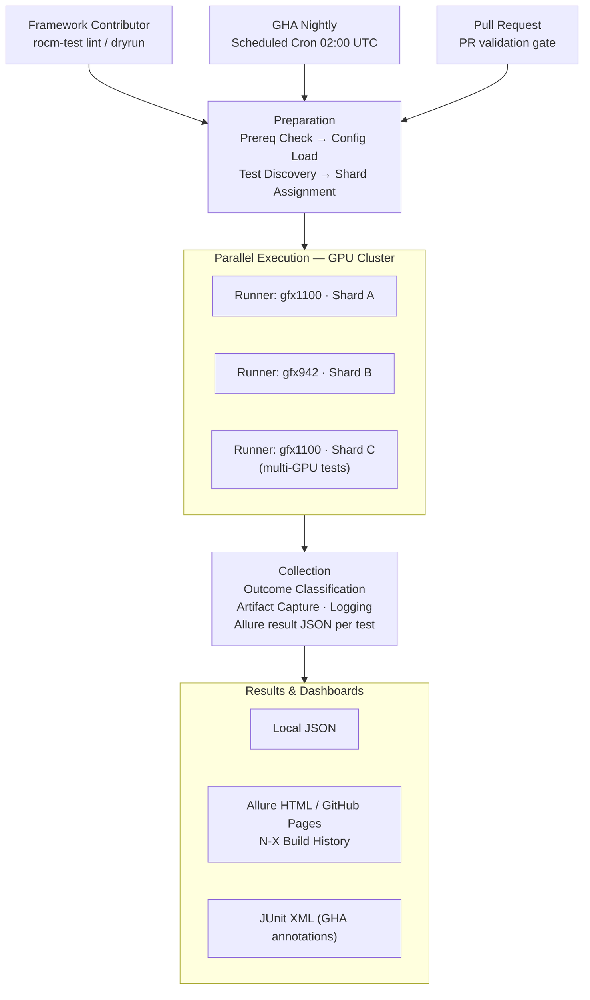
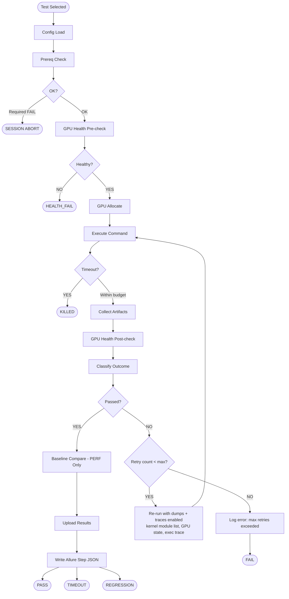

# rocm-tests: Framework Capabilities & Architecture

This document is a deep-dive companion to the root README. It covers every framework capability in detail with annotated code examples, explains the internal execution pipeline, and provides role-specific workflows for each persona who contributes to or operates this framework.

---

## Table of Contents

1. [Architecture Overview](#architecture-overview)
2. [Framework Capabilities](#framework-capabilities)
   - [Multi-Environment Execution](#multi-environment-execution)
   - [GPU Device Management](#gpu-device-management)
   - [Multi-Dimensional Test Taxonomy](#multi-dimensional-test-taxonomy)
   - [Smart Sharding](#smart-sharding)
   - [Cross-Platform Support](#cross-platform-support)
   - [Test Harness: Retry & Artifact Capture](#test-harness-retry--artifact-capture)
   - [Agentic AI Test Authoring](#agentic-ai-test-authoring)
   - [Prerequisite Contract](#prerequisite-contract)
   - [Structured Observability & Reporting](#structured-observability--reporting)
   - [CI/CD Integration](#cicd-integration)
   - [Security & Compliance](#security--compliance)
   - [Performance Baselines & Regression Detection](#performance-baselines--regression-detection)
3. [User Persona Workflows](#user-persona-workflows)
   - [QA Engineer: Writing a New Test](#qa-engineer-writing-a-new-test)
   - [Automation Engineer: Extending the Framework](#automation-engineer-extending-the-framework)
   - [DevOps Engineer: Managing CI and Reporting](#devops-engineer-managing-ci-and-reporting)
   - [New Contributor: First Test in 15 Minutes](#new-contributor-first-test-in-15-minutes)
4. [Per-Test Execution Pipeline](#per-test-execution-pipeline)

---

## Architecture Overview

The framework is layered: the plugin stack sits between pytest and test files, so test code stays focused on the workload under test.

```
pytest invocation
    └── conftest.py (root)                   # Registers all framework plugins via pytest_plugins
            ├── framework/plugins/
            │       ├── gpu_plugin.py        # --no-gpu / --gpu-arch / --mock-gpu; gpu_fixture
            │       ├── health_plugin.py     # Pre/post health gates: temp, ECC, VRAM, clock
            │       ├── baseline_plugin.py   # Per-arch YAML baseline regression comparison
            │       ├── artifacts_plugin.py  # Auto-attach artifacts to Allure steps on failure
            │       ├── prereqs_plugin.py    # Session-level driver / ROCm version checks
            │       ├── retry_plugin.py      # --retry-count; per-attempt dump + trace capture
            │       └── reports_plugin.py    # Allure label mapping; outcome_fixture
            │
            └── framework/
                    ├── config/loader.py     # Config cascade: toml → env → CLI
                    ├── executors/           # local, ssh, container, privileged, interactive, dry_run
                    ├── gpu/                 # GpuDetector (KFD/amd-smi), GpuAllocator, MockGpuDetector
                    ├── markers/             # MARKER_SCHEMA taxonomy + AST-based MarkerLinter
                    ├── os_adapter/          # Unified Linux / Windows GPU enumeration
                    ├── reporting/           # AllureReporter: step(), attach_text(), report_metric()
                    ├── results/             # Outcome classifier: PASS/FAIL/TIMEOUT/HEALTH_FAIL/PERF_*
                    └── sharding/            # SmartShardManager: LPT algorithm, VRAM-aware
```

### Plugin Load Order

Every plugin is listed in `conftest.py → pytest_plugins`. Pytest loads them left-to-right before collecting tests. Because plugins are pure pytest hooks and fixtures, adding or removing a plugin has no effect on test files — they simply gain or lose the corresponding fixture and option.

---

## Framework Capabilities

### Multi-Environment Execution

The framework abstracts the execution environment through a family of interchangeable executors. Test code calls `executor.run(command)` and receives an `ExecutionResult`; it never knows whether the command ran locally, over SSH, or in DryRun mode.

| Executor | Use Case | Key Behaviour |
|---|---|---|
| `LocalExecutor` | Real GPU on the same machine | Subprocess with `HIP_VISIBLE_DEVICES` set per the allocated GPU |
| `SSHExecutor` | Remote lab nodes | Connects via paramiko; streams stdout/stderr live |
| `ContainerExecutor` | Docker / Podman with device passthrough | Passes `--device /dev/kfd --device /dev/dri/renderD*` |
| `PrivilegedExecutor` | Kernel module ops | Runs under `capsh`/`sudo` against an allowlisted command set |
| `InteractiveExecutor` | `rocgdb` debug sessions | pexpect-driven; supports `send` / `expect` sequences |
| `DryRunExecutor` | PR validation, no GPU needed | Always returns `exit_code=0` and `stdout="DRY_RUN_OK"` |

**Example — DryRun test (no GPU required):**

```python
# tests/dry_run/test_config_loader.py
@pytest.mark.ci.pr
@pytest.mark.layer.runtime
@pytest.mark.hw.cpu_only
@pytest.mark.runtime.fast
def test_framework_dryrun(dry_run_executor, allure_reporter):
    """Validate framework wiring in DryRun mode — runs on any laptop."""
    with allure_reporter.step("Execute simulated workload"):
        result = dry_run_executor.run("echo RESULT_OK")

    assert result.ok                          # DryRunExecutor always succeeds
    assert result.exit_code == 0
```

**Example — Real GPU test using `local_executor`:**

```python
# tests/e2e/stack_validation/test_hip_runtime.py
@pytest.mark.ci.pr
@pytest.mark.layer.runtime
@pytest.mark.hw.gpu
@pytest.mark.runtime.fast
@pytest.mark.os.linux
def test_hip_runtime_available(local_executor, allure_reporter):
    """Verify HIP runtime is present and enumerates at least one AMD GPU device."""
    with allure_reporter.step("Execute HIP runtime detection script"):
        result = local_executor.run(f"python3 -c {_SCRIPT_HIP_RUNTIME!r}")

    assert result.exit_code == 0, (
        f"HIP runtime script failed (exit {result.exit_code}):\n"
        f"stdout: {result.stdout[:2000]}\nstderr: {result.stderr[:500]}"
    )
    assert "RESULT_OK" in result.stdout
    assert "HIP_NOT_FOUND" not in result.stdout
```

Swapping the executor (e.g., replacing `local_executor` with `ssh_executor`) requires no changes to the test body — only the fixture name changes.

---

### GPU Device Management

`GpuDetector` discovers AMD GPUs at session start using a two-step probe:

1. **KFD sysfs** (`/sys/class/kfd/kfd/topology/nodes/*/gpu_id`) — fast, no external binary needed
2. **`amd-smi static --json`** fallback — used when KFD sysfs is unavailable (containers, some WSL configs)

`GpuAllocator` assigns one GPU per test using a semaphore pool. When `gpu_fixture` is requested, the framework:

1. Acquires a GPU from the pool (blocks if all are in use)
2. Runs a pre-execution health check (temperature, ECC errors, VRAM free space, clock state)
3. Injects `HIP_VISIBLE_DEVICES=<device_id>` into the executor environment
4. Runs the test
5. Runs a post-execution health check
6. Returns the GPU to the pool

If either health check fails, the outcome is classified as `HEALTH_FAIL` — distinct from `FAIL` — signalling a hardware-side issue rather than a test logic failure. Recovery escalates: device reset → driver reload → node reboot (remote nodes only).

**`--mock-gpu` mode** substitutes `MockGpuDetector`, which returns synthetic `gfx942` GPU objects. No real hardware is allocated; all health checks are skipped. Use this for testing framework logic without GPU hardware.

```bash
# Real GPU run — allocates from actual /dev/kfd devices
pytest tests/e2e/ -m "hw.gpu and ci.pr" -v

# Mock GPU — synthetic gfx942, no /dev/kfd access needed
pytest tests/e2e/ --mock-gpu -v

# No GPU at all — DryRunExecutor, no allocation attempted
pytest tests/e2e/ --no-gpu -v
```

---

### Multi-Dimensional Test Taxonomy

Every test function must carry markers from three required dimensions and may carry markers from three optional dimensions. The marker taxonomy is defined in `framework/markers/taxonomy.py → MARKER_SCHEMA` — the single source of truth.

| Dimension | Required | Valid Values | Purpose |
|---|---|---|---|
| `hw.*` | **YES** | `gpu`, `multi_gpu`, `cpu_only` | Hardware gate — skips test on incompatible runners |
| `ci.*` | **YES** | `pr`, `nightly`, `weekly`, `smoke_e2e` | CI tier — controls runner provisioning and schedule |
| `layer.*` | **YES** | `driver`, `runtime`, `math_lib`, `ml_framework`, `debug_stack` | ROCm stack layer — drives Allure grouping and coverage reports |
| `runtime.*` | optional | `fast` (<5 min), `medium` (<30 min), `longevity` (<2 hr), `soak` (hours) | Wall-time estimate — feeds Smart Sharding weight |
| `os.*` | optional | `linux`, `windows`, `wsl`, `both` | Platform gate — auto-skips on incompatible OS |
| `e2e.*` | optional | `stack`, `multinode`, `app`, `upgrade` | Scenario type — drives dashboard categorisation |

**Why dotted syntax works:**

`@pytest.mark.ci.pr` is syntactic sugar. A `MarkDecorator.__getattr__` patch in `conftest.py` resolves the dotted chain into the underlying pytest mark `"ci.pr"`. The string `"ci.pr"` is the actual marker name stored in pytest's node item.

**Selecting tests by marker expression:**

```bash
# All PR-gate tests (any hardware)
pytest tests/ -m "ci.pr"

# Nightly GPU-only tests on a specific architecture
pytest tests/e2e/ -m "hw.gpu and ci.nightly" --gpu-arch gfx942

# Everything except tests that require multi-GPU hardware
pytest tests/ -m "not hw.multi_gpu" --no-gpu

# Performance tests for the math library layer
pytest tests/ -m "layer.math_lib and ci.nightly"

# Preview matched tests without executing them
pytest tests/ -m "hw.gpu and ci.pr" --collect-only -q
```

**MarkerLinter:** `framework/markers/linter.py` parses test ASTs and validates every `@pytest.mark.*` decorator against `MARKER_SCHEMA`. It runs as a Claude Code `PostToolUse` hook whenever a test file is written or edited — violations are reported immediately, before CI.

---

### Smart Sharding

When multiple GPU devices are available, `SmartShardManager` distributes tests automatically using a **Longest Processing Time (LPT)** algorithm:

1. Collects all test items and their `runtime.*` weight (fast=1, medium=6, longevity=24, soak=48 — arbitrary units)
2. Sorts tests descending by weight
3. Assigns each test to the GPU with the lowest current load, accounting for the GPU's available VRAM

This produces near-optimal makespan without manual test group definitions. The shard assignment is logged at `INFO` level before execution begins so the distribution is inspectable.

Smart Sharding is **mutually exclusive** with pytest-xdist GPU sharding. Use Smart Sharding for single-node multi-GPU setups; configure xdist workers for multi-node parallelism.

---

### Cross-Platform Support

`framework/os_adapter/` provides a unified interface for GPU enumeration across Linux and Windows. The factory (`factory.py`) selects the correct adapter at session start:

| Platform | Adapter | Detection Method |
|---|---|---|
| Linux | `LinuxAdapter` | `/dev/kfd`, `/dev/dri/renderD*` enumeration via sysfs |
| Windows | `WindowsAdapter` | `amd-smi static --json` output parsing |
| WSL | `WindowsAdapter` (auto-detected) | WSL environment variable detection → Windows path |

Test files carry an `os.*` marker. The framework reads this marker during collection and automatically skips tests on incompatible platforms — no `if sys.platform` guards in test code.

```python
@pytest.mark.os.linux   # skipped automatically on Windows runners
def test_linux_specific_feature(local_executor, allure_reporter):
    ...
```

---

### Test Harness: Retry & Artifact Capture

The retry harness wraps every test via `retry_plugin.py`. Configurable via `--retry-count N` (default: 0) or `rocm-test.toml`.

On each failed attempt, before retrying, the harness automatically collects:

- **Kernel module list** (`lsmod | grep amd`)
- **GPU state dump** (`amd-smi --json`)
- **Execution trace** (stdout + stderr of the failed command, timestamped)

These are attached to the Allure step for the failed attempt. If the test passes on a retry, it is tagged `flaky` in the report. Persistent flakiness trends surface across the N-build Allure history window.

```toml
# rocm-test.toml
[test]
retry_count = 2          # retry up to 2 times before marking FAIL
retry_delay_s = 5        # wait 5 s between attempts
```

```bash
# Override at the CLI
pytest tests/e2e/ -m "hw.gpu and ci.pr" --retry-count 3 -v
```

---

### Agentic AI Test Authoring

The framework ships a built-in agentic AI layer accessible from Claude Code. Three skills are available:

| Skill | What It Does |
|---|---|
| `/new-test` | Generates a complete, marker-compliant test file from a natural-language description |
| `/extend-test` | Adds coverage, parametrisation, or new scenarios to an existing test file |
| `/check-test <file>` | Four-persona review (developer, tester, automation, devops) + marker lint |

**Typical flow:**

```bash
# Open Claude Code in the repo root
claude

# Describe the test you need
/new-test
> Validate that hipGetDeviceCount returns at least 1 on a gfx942 node
```

The agent reads `framework/markers/taxonomy.py`, existing test patterns, and the framework fixtures before generating output. It never invents marker values or fixture names. The generated file is immediately linted by `MarkerLinter`.

```bash
# Validate the generated file collects cleanly (no GPU needed)
pytest tests/e2e/stack_validation/test_my_feature.py --collect-only -q --no-gpu

# Four-persona review before opening a PR
/check-test tests/e2e/stack_validation/test_my_feature.py
```

---

### Prerequisite Contract

`prereqs_plugin.py` gates session start with typed prerequisite checks:

| Check | Required | Failure Behaviour |
|---|---|---|
| `amdgpu` driver loaded (`lsmod`) | Required | Session abort — all tests skipped |
| ROCm version ≥ configured minimum | Required | Session abort |
| GPU count ≥ 1 | Required for `hw.gpu` tests | Session abort |
| Disk space ≥ threshold | Required | Session abort |
| PyTorch importable + ROCm backend | Optional | Tests with `layer.ml_framework` skipped |
| Network reachable (for remote executors) | Optional | SSH tests skipped |

Required failures emit a structured message listing every failed check and the expected vs. actual value, then abort the session immediately. Optional failures skip dependent tests without aborting.

```bash
# Audit prerequisites without running tests
rocm-test prereqs check

# Attempt auto-remediation (installs missing packages, reloads modules)
rocm-test prereqs install
```

---

### Structured Observability & Reporting

**Correlation IDs:** Every log line carries a `run_id + test_id + phase` tuple. `run_id` is a UUID generated at session start; `test_id` is the pytest node ID. This makes failures traceable through the full execution chain across log aggregators.

**Live GPU telemetry:** During test execution, `health_plugin.py` samples GPU temperature, VRAM utilisation, clock state, and ECC error count. Samples are attached to the Allure step as a JSON artifact.

**Outcome classifier** (`framework/results/classifier.py`) maps every test exit to one of eight discrete outcomes:

| Outcome | Meaning |
|---|---|
| `PASS` | Test completed and all assertions passed |
| `FAIL` | Test completed and at least one assertion failed |
| `TIMEOUT` | Command exceeded its configured wall-time budget |
| `KILLED` | Framework terminated the process (VRAM exhaustion or OOM) |
| `ERROR` | Unexpected exception in test or fixture setup/teardown |
| `HEALTH_FAIL` | Pre- or post-execution GPU health check failed |
| `PERF_DROP` | Measured value dropped below baseline threshold |
| `REGRESSION` | Broader regression marker (encompasses `PERF_DROP` and error patterns) |

**Allure integration:**

```python
def test_pytorch_rocm_smoke(gpu_fixture, allure_reporter):
    with allure_reporter.step("Import PyTorch and verify ROCm backend"):
        result = gpu_fixture.run(f"python3 -c {repr(_SCRIPT_PYTORCH_SMOKE)}")

    assert "RESULT_OK" in result.stdout

    # Attach raw output to the Allure step — visible in the dashboard
    allure_reporter.attach(result.stdout, name="pytorch_smoke_output")

    # Report a numeric metric — plotted in Allure trend charts
    allure_reporter.metric("THROUGHPUT_STEPS_SEC", 142.7, unit="steps/s")
```

---

### CI/CD Integration

All workflows are auto-triggered — no manual dispatch is needed for standard runs.

| Workflow | Trigger | GPU | Purpose |
|---|---|---|---|
| `pre-commit.yml` | Every pull request | No | DryRun tests, ruff, black, mypy, bandit, marker lint, MkDocs strict build |
| `e2e-nightly.yml` | Scheduled cron 02:00 UTC | Yes | Full E2E matrix across GPU cluster (gfx942, gfx1100, …) |
| `publish-reports.yml` | After nightly job | No | Allure N-X history merge → generate → deploy to GitHub Pages |
| `security-scan.yml` | Every pull request | No | Bandit SAST + pip-audit CVE scan |
| `docs.yml` | Merge to `main` | No | Auto-generate marker reference + test catalog → deploy docs |

**CI Lifecycle Flow:**



---

### Security & Compliance

| Control | Tool | Trigger |
|---|---|---|
| Static analysis | Bandit | Every pull request (`security-scan.yml`) |
| Dependency CVE scan | pip-audit | Every pull request |
| Secret detection | Gitleaks | Every pull request |
| Privileged op allowlist | `PrivilegedExecutor` | Runtime — blocks unlisted `sudo` commands |
| Zero credentials in code | Config cascade + GHA secrets | Enforced by convention; Gitleaks catches violations |

---

### Performance Baselines & Regression Detection

Benchmark expectations are stored as YAML files under `tests/e2e/performance/baselines/<arch>/`.

```yaml
# tests/e2e/performance/baselines/gfx942/rocblas.yaml
DGEMM_TFLOPS:
  expected: 24.5
  tolerance_pct: 5.0       # PERF_DROP if measured < 23.275 TFLOPS
  unit: TFLOPS

RCCL_BW_GBPS:
  expected: 180.0
  tolerance_pct: 8.0
  unit: GB/s
```

`baseline_fixture` reads the YAML for the current `--gpu-arch` and exposes `baseline_fixture.compare(key, measured_value)`. If the measured value falls outside the tolerance band, the outcome is classified as `PERF_DROP` rather than `FAIL` — so performance regressions are never buried in generic test failures.

```python
@pytest.mark.ci.nightly
@pytest.mark.layer.math_lib
@pytest.mark.hw.gpu
@pytest.mark.runtime.medium
def test_rocblas_dgemm_throughput(local_executor, allure_reporter, baseline_fixture):
    result = local_executor.run("rocblas-bench -f gemm --transpA N --transpB N ...")
    tflops = parse_metric(result.stdout, "TFLOPS")

    allure_reporter.metric("DGEMM_TFLOPS", tflops, unit="TFLOPS")
    baseline_fixture.compare("DGEMM_TFLOPS", tflops)   # raises PERF_DROP if out of band
```

---

## User Persona Workflows

### QA Engineer: Writing a New Test

**Goal:** Add a new functional E2E test for a ROCm stack feature.

**Workflow:**

```
1. Identify the target layer and CI tier
       │
       ▼
2. Clone the repo and set up the dev environment
   git clone https://github.com/ROCm/rocm-tests.git
   cd rocm-tests
   python3 -m venv .venv && source .venv/bin/activate
   pip install -r requirements-dev.txt
       │
       ▼
3. (Optional) Use AI authoring to scaffold the test
   claude
   /new-test
   > Validate that hipMemcpy completes within 50 ms for a 1 GB transfer on gfx942
       │
       ▼
4. Place the file in the correct layer directory
   tests/e2e/<layer>/test_<feature>.py
   (match directory to the layer.* marker you intend to use)
       │
       ▼
5. Write/edit the test — minimum three required markers
       │
       ▼
6. Validate locally without GPU hardware
   pytest tests/e2e/stack_validation/test_my_feature.py --collect-only -q --no-gpu
       │
       ▼
7. Run lint and DryRun suite
   ruff check framework tests
   black --check framework tests
   pytest tests/ -m "not hw.gpu" --no-gpu -v
       │
       ▼
8. (Optional) Four-persona AI review
   /check-test tests/e2e/stack_validation/test_my_feature.py
       │
       ▼
9. Open pull request — CI runs automatically
```

**Minimum valid test template:**

```python
# tests/e2e/stack_validation/test_my_feature.py
# Copyright Advanced Micro Devices, Inc.
# SPDX-License-Identifier: MIT

import pytest


@pytest.mark.ci.pr            # required: CI gate dimension
@pytest.mark.layer.runtime    # required: ROCm stack layer dimension
@pytest.mark.hw.cpu_only      # required: hardware requirement dimension
@pytest.mark.runtime.fast     # recommended: wall-time estimate for sharding
def test_my_feature_dryrun(dry_run_executor, allure_reporter):
    """Verify feature X is reachable in DryRun mode (no GPU required)."""
    with allure_reporter.step("Run feature check"):
        result = dry_run_executor.run("echo RESULT_OK")

    assert result.ok
    assert "RESULT_OK" in result.stdout


@pytest.mark.ci.nightly
@pytest.mark.layer.runtime
@pytest.mark.hw.gpu
@pytest.mark.runtime.fast
@pytest.mark.os.linux
def test_my_feature_gpu(local_executor, allure_reporter):
    """Verify feature X on real AMD GPU hardware."""
    with allure_reporter.step("Execute GPU check"):
        result = local_executor.run("python3 -c 'print(\"RESULT_OK\")'")

    assert result.exit_code == 0
    assert "RESULT_OK" in result.stdout
```

**Layer → directory mapping:**

| `layer.*` marker | Directory |
|---|---|
| `layer.runtime` | `tests/e2e/stack_validation/`, `tests/e2e/compiler/` |
| `layer.math_lib` | `tests/e2e/multi_gpu/` |
| `layer.ml_framework` | `tests/e2e/ml_frameworks/` |
| `layer.driver` | `tests/e2e/recovery/`, `tests/e2e/upgrade/` |
| `layer.debug_stack` | `tests/e2e/debug_stack/` |

---

### Automation Engineer: Extending the Framework

**Goal:** Add a new executor, plugin, or extend the marker taxonomy.

**Adding a new executor:**

1. Create `framework/executors/my_executor.py` implementing the `AbstractExecutor` interface
2. Expose a pytest fixture in `framework/plugins/gpu_plugin.py` (or a new plugin file)
3. Register the plugin in `conftest.py → pytest_plugins`
4. Write a DryRun-compatible test under `tests/dry_run/` to validate the new executor in CI

```python
# framework/executors/my_executor.py
from framework.executors.abstract_executor import AbstractExecutor
from framework.common.helpers import ExecutionResult


class MyExecutor(AbstractExecutor):
    def run(self, command: str, timeout: int = 300) -> ExecutionResult:
        # ... implementation
        return ExecutionResult(exit_code=0, stdout="", stderr="")
```

**Adding a new marker value:**

All valid marker values live in `framework/markers/taxonomy.py → MARKER_SCHEMA`. Adding a value anywhere else will cause `MarkerLinter` to reject it.

```python
# framework/markers/taxonomy.py
MARKER_SCHEMA = {
    "hw": ["gpu", "multi_gpu", "cpu_only"],
    "ci": ["pr", "nightly", "weekly", "smoke_e2e"],
    "layer": ["driver", "runtime", "math_lib", "ml_framework", "debug_stack", "my_new_layer"],  # ← add here
    ...
}
```

**Extending the AI agent (skills):**

Agent definitions live in `.claude/agents/`. Each `.md` file defines a skill's prompt, tools, and output format. Add a new `.md` file to expose a new slash command; the agent auto-loads on next `claude` session start.

---

### DevOps Engineer: Managing CI and Reporting

**Goal:** Operate and tune the CI pipeline, Allure dashboards, and runner provisioning.

**Key files:**

| File | Purpose |
|---|---|
| `.github/workflows/e2e-nightly.yml` | Nightly GPU cluster run — tune cron schedule, runner labels, shard count |
| `.github/workflows/publish-reports.yml` | Allure history merge — tune N-build window |
| `rocm-test.toml` | Framework config — thresholds, retry counts, artifact paths |
| `matrix/` | Test matrix JSON definitions — control which tests run on which shard |

**Adding a new GPU architecture to the nightly matrix:**

```yaml
# .github/workflows/e2e-nightly.yml
strategy:
  matrix:
    gpu_arch: [gfx942, gfx1100, gfx1200]   # ← add new arch here
    include:
      - gpu_arch: gfx1200
        runner: self-hosted-gfx1200
```

Add a corresponding baseline directory:

```bash
mkdir tests/e2e/performance/baselines/gfx1200/
# Create YAML baseline files for each benchmark
```

**Tuning GPU health thresholds:**

```toml
# rocm-test.toml
[gpu]
max_temp_celsius = 85          # HEALTH_FAIL if GPU exceeds this during test
max_ecc_errors = 0             # HEALTH_FAIL on any ECC error
min_vram_free_mb = 512         # HEALTH_FAIL if less than 512 MB VRAM free before test
```

**Publishing Allure reports locally:**

```bash
# Generate Allure report from a previous run's results
allure generate build/allure-results --clean -o build/allure-report
allure open build/allure-report
```

---

### New Contributor: First Test in 15 Minutes

**Goal:** Understand the framework and get a test running in the shortest possible path.

```bash
# Step 1: Set up the environment (2 min)
git clone https://github.com/ROCm/rocm-tests.git
cd rocm-tests
python3 -m venv .venv && source .venv/bin/activate
pip install -r requirements-dev.txt

# Step 2: Verify the framework runs without GPU (1 min)
pytest tests/ -m "not hw.gpu" --no-gpu -v --tb=short
# All tests should pass — this is your baseline.

# Step 3: Preview the existing test catalogue (1 min)
pytest tests/ --collect-only -q --no-gpu
# Browse the test IDs and marker expressions.

# Step 4: Copy an existing test as your starting point (2 min)
cp tests/e2e/stack_validation/test_hip_runtime.py \
   tests/e2e/stack_validation/test_my_first_test.py

# Step 5: Edit — change the function name, docstring, and command (5 min)
# At minimum, update:
#   - def test_<your_name>(...)
#   - the command passed to executor.run(...)
#   - the assertion on result.stdout

# Step 6: Verify collection (30 sec)
pytest tests/e2e/stack_validation/test_my_first_test.py --collect-only -q --no-gpu

# Step 7: Run in DryRun mode (30 sec)
pytest tests/e2e/stack_validation/test_my_first_test.py --no-gpu -v

# Step 8: Lint (1 min)
ruff check tests/e2e/stack_validation/test_my_first_test.py
black --check tests/e2e/stack_validation/test_my_first_test.py

# Step 9: Open a PR — CI handles the rest
```

If anything is unclear, open Claude Code in the repo root and ask:

```bash
claude
/check-test tests/e2e/stack_validation/test_my_first_test.py
```

The agent reviews the file from four perspectives and lists the top three actionable improvements.

---

## Per-Test Execution Pipeline

Every test, regardless of executor or CI tier, passes through the same pipeline:



**Key pipeline invariants:**

- Config and prereq checks run **once per session**, not per test
- GPU allocation and health checks run **per test** via `gpu_fixture`
- Artifact collection runs **on every failed attempt** (not just the final one)
- Baseline comparison runs **only for tests that pass** (no point comparing a failing workload)
- Allure JSON is written **regardless of outcome** — `HEALTH_FAIL` and `REGRESSION` both appear in the dashboard
