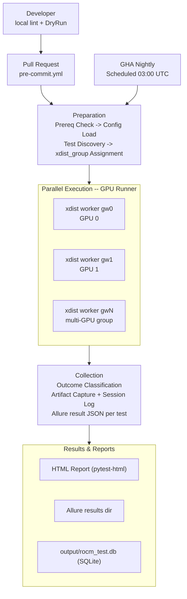
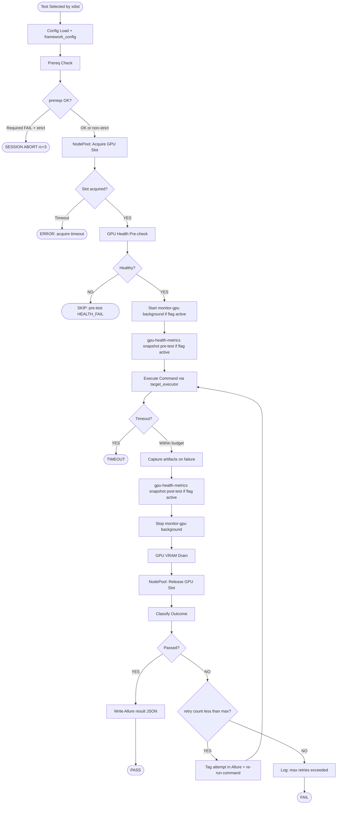

# Framework Architecture

This document is a deep-dive companion to the root README. It covers every framework capability in detail with annotated code examples, explains the internal execution pipeline, and provides role-specific workflows for each scenario.

---

## Table of Contents

1. [Architecture Overview](#architecture-overview)
   - [Layer Stack](#layer-stack)
   - [Plugin Load Order](#plugin-load-order)
2. [Framework Capabilities](#framework-capabilities)
   - [Multi-Environment Execution](#multi-environment-execution)
   - [GPU Device Management](#gpu-device-management)
   - [Node Pool & Fleet Management](#node-pool--fleet-management)
   - [Multi-Dimensional Test Taxonomy](#multi-dimensional-test-taxonomy)
   - [Dynamic Scheduling](#dynamic-scheduling)
   - [HIP Binary Compilation](#hip-binary-compilation)
   - [Cross-Platform Support](#cross-platform-support)
   - [Test Harness: Retry & Artifact Capture](#test-harness-retry--artifact-capture)
   - [Prerequisite Contract](#prerequisite-contract)
   - [Configuration Reference](#configuration-reference)
   - [Pre-Install Fleet Provisioning](#pre-install-fleet-provisioning)
   - [Structured Observability & Reporting](#structured-observability--reporting)
   - [Agentic AI Test Authoring](#agentic-ai-test-authoring)
   - [CI/CD Integration](#cicd-integration)
3. [Writing Tests: Workflows by Use Case](#writing-tests-workflows-by-use-case)
   - [First Test in 15 Minutes (DryRun / cpu_only)](#first-test-in-15-minutes-dryrun--cpu_only)
   - [Single-GPU E2E Test](#single-gpu-e2e-test)
   - [Multi-GPU Test](#multi-gpu-test)
   - [HIP Compiler Test](#hip-compiler-test)
   - [Test with Retry Harness](#test-with-retry-harness)
4. [Operating the Framework](#operating-the-framework)
   - [Local Single-GPU Run](#local-single-gpu-run)
   - [Local Multi-GPU Run with Dynamic Scheduling](#local-multi-gpu-run-with-dynamic-scheduling)
   - [Remote Fleet Run](#remote-fleet-run)
   - [Pre-Installing ROCm on Fleet Nodes](#pre-installing-rocm-on-fleet-nodes)
   - [Container Mode](#container-mode)
   - [HTML and Allure Reports](#html-and-allure-reports)
   - [GPU Health Thresholds & Monitoring](#gpu-health-thresholds--monitoring)
5. [Per-Test Execution Pipeline](#per-test-execution-pipeline)

---

## Architecture Overview

### Layer Stack

The framework is layered: the modular plugin stack sits between pytest and test files, so test code stays focused on the workload under test.
Test files call `Requisite Executor` and receive an `Execution Result` — they never know whether the command ran locally, over SSH, in a container, or in DryRun mode.

```
pytest invocation
  └── conftest.py (root)
        ├── MarkDecorator.__getattr__ patch   # enables @pytest.mark.ci.pr dotted syntax (pytest 7+)
        └── pytest_plugins = [13 plugins, registration order matters]
              ├── markers_plugin      # FIRST: category-profile marker injection (CATEGORY_PROFILES)
              ├── gpu_plugin          # --no-gpu/--gpu-arch/--mock-gpu; gpu_arch; dry_run_executor
              ├── remote_node_plugin  # NodePool; target_executor; multi_gpu_fixture; multi_node_fixture
              ├── scheduling_plugin   # DynamicScheduler; --schedule-policy; --collect-runtimes
              ├── executor_plugin     # cpu_executor; container_executor
              ├── os_plugin           # os_adapter; platform_name; os.* marker skip hook
              ├── health_plugin       # health_fixture; GpuHealthChecker (temp/ECC/VRAM gates)
              ├── artifacts_plugin    # allure_reporter; artifacts_fixture; GPU state dump on failure
              ├── prereqs_plugin      # prereqs_fixture; Python>=3.10 + ROCm tool checks
              ├── retry_plugin        # retry_fixture; --retry-count; RetryHelper
              ├── reports_plugin      # outcome_fixture; Allure label mapping; terminal summary
              ├── builder_plugin      # rock_dir; compile_binary; ld_path (TheRock HIP binaries)
              └── install_plugin      # --pre-install rocm=X/pkg=X; parallel fleet provisioning

framework/
  config/       FrameworkConfig dataclasses; load_config() 4-level cascade
  common/       ExecutionResult; Outcome enum; executor_log_path(); gpu_monitor_log_path()
  executors/    AbstractExecutor + concrete backends + BackgroundProcess
  nodes/        NodePool; NodeSlot; MultiGpuSlots; GpuFileLock; PendingTracker
  scheduling/   DynamicScheduler; SchedulePolicy (LPT algorithm; xdist_group assignment)
  builder/      BinaryBuilder; hipcc compilation; xdist-safe file locking; incremental builds
  gpu/          GpuDetector; MockGpuDetector; GpuAllocator; GpuDrainChecker; GpuBackgroundMonitor
  markers/      MARKER_SCHEMA; MarkerLinter (AST-based); CATEGORY_PROFILES; ALLURE_DIMENSION_MAP
  reporting/    AllureReporter; step(); attach_text(); report_metric()
  os_adapter/   AbstractOsAdapter; LinuxOsAdapter; WindowsOsAdapter
  rocm/libs/    hip.py; rccl.py; amd_smi.py; stack.py

tests/
  common/                        factories.py (fake_gpu_info, fake_execution_result); _cmake_build.py -- NOT test files
  dry_run/                       ci.pr DryRun / cpu_only tests (no GPU required)
  e2e/
    compiler/                    hipcc compilation tests; CompileSpec conftest registry
    hip_runtime/                 HIP driver API and multi-stream kernel tests; CMake build
    hipblaslt/                   hipBLASLt GEMM heuristic and shape-boundary tests; CMake build
    hwq_heuristic/               hardware queue heuristic tests; CMake build
    rocm_libs/                   rocsolver, rocblas, and other ROCm library tests; CMake build
    rocprim/                     rocPRIM primitives and multi-GPU HMM tests; CMake build
```

### Plugin Load Order

Every plugin is listed in `conftest.py -> pytest_plugins`. Pytest loads them left-to-right before collecting tests.

**Critical ordering constraint:** `markers_plugin` **must be first**. It injects `hw.*`, `ci.*`, and `layer.*` markers from `CATEGORY_PROFILES` during `pytest_collection_modifyitems`. Any plugin that reads those markers — `scheduling_plugin` (sorts by `hw.*`) and `gpu_plugin` (skips by `hw.gpu`) — must be registered after `markers_plugin` so that profile-annotated tests are fully marked before they are sorted or skipped.

**Dotted marker syntax:** `conftest.py` patches `MarkDecorator.__getattr__` to enable `@pytest.mark.ci.pr` notation. pytest 7+ removed this behaviour; the patch restores it by delegating `pytest.mark.ci.pr` to `getattr(pytest.mark, "ci.pr")`.

| Plugin | CLI options added | Key fixtures provided |
|---|---|---|
| `markers_plugin` | — | — (hook only: injects profile markers at collection) |
| `gpu_plugin` | `--no-gpu`, `--gpu-arch`, `--mock-gpu`, `--rocm-config` | `gpu_arch`, `dry_run_executor` |
| `remote_node_plugin` | `--remote-node`, `--gpu-acquire-timeout`, `--gpu-health-metrics`, `--monitor-gpu`, `--gpu-drain-secs`, `--gpu-drain-timeout` | `node_pool`, `target_executor`, `multi_gpu_fixture`, `multi_node_fixture` |
| `scheduling_plugin` | `--schedule-policy`, `--collect-runtimes`, `--vram-headroom-gb` | — (hook only: sorts items, assigns xdist_group) |
| `executor_plugin` | `--container-mode`, `--container-image`, `--container-runtime` | `cpu_executor`, `container_executor` |
| `os_plugin` | — | `os_adapter`, `platform_name` |
| `health_plugin` | — | `health_fixture` |
| `artifacts_plugin` | — | `allure_reporter`, `artifacts_fixture` |
| `prereqs_plugin` | `--strict-prereqs` | `prereqs_fixture` |
| `retry_plugin` | `--retry-count` | `retry_fixture` |
| `reports_plugin` | `--allure-log-name`, `--allure-db` | `outcome_fixture` |
| `builder_plugin` | `--rock-dir`, `--compiler-build-dir` | `rock_dir`, `compiler_build_dir`, `compile_binary`, `ld_path` |
| `install_plugin` | `--pre-install` | — (hook only: parallel fleet pre-install at session start) |

---

## Framework Capabilities

### Multi-Environment Execution

The framework abstracts the execution environment through a family of interchangeable executors.
Test code always calls `executor.run(command)` and receives an `ExecutionResult(exit_code, stdout, stderr, duration)` — it never knows which executor is active.

#### Executor Hierarchy

| Executor | Role | When used internally |
|---|---|---|
| `DryRunExecutor` | Synthetic stub; never shells out; returns `exit_code=0` with synthetic stdout | `--no-gpu` / `hw.cpu_only` PR gate |
| `CpuExecutor` | Real subprocess, no GPU env injection | `hw.cpu_only` tests needing real commands |
| `LocalExecutor` | Local subprocess; injects `ROCR_VISIBLE_DEVICES` | Local `hw.gpu` and `hw.multi_gpu` |
| `ContainerExecutor` | Docker/Podman with AMD GPU passthrough | `--container-mode` |
| `SshExecutor` | SSH + `ROCR_VISIBLE_DEVICES` injection | Remote `hw.gpu` and `hw.multi_gpu` |
| `NodeExecutorGroup` | Uniform container returned by all GPU fixtures | Always: the type `target_executor` yields |

All concrete executors share `AbstractExecutor` with a single required method `run(command, timeout)` and an optional `start_background(command, timeout, log_path)`.

#### `target_executor` — Unified GPU Fixture

Use `target_executor` for **all** GPU tests. It dispatches internally based on markers, CLI flags, and the node topology — test code always receives a `NodeExecutorGroup` with the same `.run()` API.

| Markers / flags on test | `target_executor` yields | Test code pattern |
|---|---|---|
| `hw.gpu` | `NodeExecutorGroup(1 executor)` | `target_executor.run(cmd)` |
| `hw.multi_gpu` + `gpu_count(N)` | `NodeExecutorGroup(1 exec, ROCR=0,1,...,N-1)` | `target_executor.run(cmd)` |
| `e2e.multinode` + `gpu_count(N)` | `NodeExecutorGroup(N execs, 1 per node)` — requires `--remote-node` with 2+ nodes | `for e in target_executor: e.run(cmd)` |
| `gpu_indices([i, j, ...])` | `NodeExecutorGroup(1 exec, exact indices pinned)` | `target_executor.run(cmd)` |
| any + `--no-gpu` | `NodeExecutorGroup(DryRunExecutor)` | `target_executor.run(cmd)` |
| any + `--container-mode` | `NodeExecutorGroup(ContainerExecutor)` — no NodePool slot | `target_executor.run(cmd)` |

**GPU isolation:** `ROCR_VISIBLE_DEVICES` is always set by `LocalExecutor` / `SshExecutor`. Never set it in test code.

#### Background Processes

Run a daemon alongside a test and capture its output:

```python
def test_kernel_with_monitoring(target_executor, cpu_executor):
    with cpu_executor.start_background(
        "rocm-smi --showmetrics --interval=2",
        log_path="output/artifacts/executor-logs/test__monitor.log",
    ) as monitor:
        result = target_executor.run("./my_kernel --iterations=100")
        assert result.ok
        assert "RESULT_OK" in result.stdout
        assert monitor.is_alive

    stopped = monitor.stop_result   # ExecutionResult with daemon's captured output
    assert stopped.exit_code in (0, -15)  # clean stop or SIGTERM
```

`DryRunExecutor.start_background()` returns a `NoOpBackgroundProcess` with the same API (`.is_alive` is always `False`). SSH executors do not yet support background processes.

#### `manual_gpu_allocator` — Explicit Per-Index Acquisition

`manual_gpu_allocator` is an alternative to `target_executor` for tests that must pin to a specific GPU index rather than accepting the pool's NUMA best-fit selection. Intended for benchmark pinning, per-GPU diagnostics, and external workflows that manage GPU assignment themselves.

```python
@pytest.mark.hw.gpu
@pytest.mark.ci.nightly
@pytest.mark.layer.runtime
@pytest.mark.runtime.fast
def test_benchmark_pinned(manual_gpu_allocator):
    # Context manager (recommended) — acquires GPU 0, releases on exit
    with manual_gpu_allocator.pin(gpu_index=0) as executor:
        result = executor.run("./benchmark --warmup 3 --iterations 10")
        assert result.ok

    # Explicit acquire/release — useful when two GPUs must be held together
    ex0 = manual_gpu_allocator.acquire(0)
    ex1 = manual_gpu_allocator.acquire(1)
    try:
        r0 = ex0.run("rocm-smi --showmeminfo vram")
        r1 = ex1.run("rocm-smi --showmeminfo vram")
        assert r0.ok and r1.ok
    finally:
        manual_gpu_allocator.release(ex0)
        manual_gpu_allocator.release(ex1)
```

The fixture uses the same `NodePool` and `GpuFileLock` infrastructure as `target_executor` — cross-process exclusivity is maintained. In `--no-gpu` mode all `acquire()` calls return a `DryRunExecutor` group so test logic can be validated in CI. If a test finishes without releasing all acquired slots, the fixture calls `pytest.fail` and releases them on behalf of the test.

Available API: `.acquire(gpu_index)`, `.release(group)`, `.pin(gpu_index)` (context manager), `.available_gpus` (read-only snapshot of all detected GPUs in the pool).

#### `ExecutionResult`

Every `run()` call returns:

```python
@dataclass
class ExecutionResult:
    exit_code: int
    stdout: str
    stderr: str
    duration: float   # wall-clock seconds

    @property
    def ok(self) -> bool:
        return self.exit_code == 0
```

---

### GPU Device Management

#### Detection

`GpuDetector` uses `lspci -d 1002: -nn` as the primary detection method — no AMD driver required, works locally and over SSH. When GPUs are found, `amd-smi list` runs once for diagnostics; the output is written to `output/artifacts/gpu-info-<node>.log`.

Use `--mock-gpu` to substitute `MockGpuDetector` (synthetic GPU list) for framework-level unit tests. Use `--no-gpu` to skip all GPU acquisition and route through `DryRunExecutor`.

```bash
# Real hardware detection (default)
pytest tests/e2e/ -m "hw.gpu and ci.nightly" -v

# Synthetic GPU list (framework testing only)
pytest tests/ --mock-gpu --no-gpu -v
```

#### Allocation

`GpuAllocator` selects a GPU slot filtered by:

- `--gpu-arch ARCH` — restrict to a specific GFX architecture (e.g. `gfx942`)
- `@pytest.mark.gpu_vram(N)` — require at least N GB of free VRAM
- `--vram-headroom-gb GB` (default 2.0) — additional VRAM buffer reserved per GPU

If no GPU meets the requirements, the test is **skipped** (not failed).

#### Health Checks

`GpuHealthChecker` (from `health_plugin`) runs `amd-smi metric --gpu N --json` and checks against toml thresholds:

- **Pre-test gate:** if the GPU is already degraded, the test is **skipped** and the GPU is returned to the pool.
- **Post-test gate:** if the GPU degraded during the test, a **warning** is logged but the test outcome is not changed.

```toml
# rocm-test.toml
[gpu]
max_temp_celsius  = 90    # HEALTH_FAIL if GPU temp exceeds this
max_ecc_errors    = 0     # HEALTH_FAIL on any ECC error
min_vram_free_mb  = 512   # HEALTH_FAIL if less than 512 MB VRAM free
```

`GpuHealthChecker` degrades gracefully when `amd-smi` is absent — returns `HealthResult(passed=True)`.

#### Point-in-Time Snapshots

`--gpu-health-metrics METRICS` triggers an `amd-smi` snapshot **before and after each test**, attached to the Allure step:

```bash
pytest tests/e2e/ -m "ci.nightly" --gpu-health-metrics temp,vram,ecc -v
```

Valid metric names: `temp`, `vram`, `util`, `ecc`, `clock`.

#### Continuous Background Monitoring

`--monitor-gpu` starts a `GpuBackgroundMonitor` for each test. Samples are written to `output/artifacts/executor-logs/<test>_gpu_monitor.log` at `monitor_interval_secs` intervals:

```bash
pytest tests/e2e/ -m "ci.nightly" --monitor-gpu -v
```

Configure via `rocm-test.toml`:

```toml
[gpu]
monitor_metrics       = ["temp", "vram", "util", "ecc", "clock"]
monitor_interval_secs = 15.0    # seconds between polls
monitor_duration_secs = 0.0     # 0 = stop when test ends; >0 = cap monitoring time
```

#### VRAM Drain

After each test teardown, `GpuDrainChecker` polls `amd-smi` until VRAM returns to its pre-test level or the timeout expires. This prevents GPU memory fragmentation from affecting subsequent tests:

```bash
pytest tests/e2e/ --gpu-drain-secs 1.0 --gpu-drain-timeout 60 -v
```

---

### Node Pool & Fleet Management

`NodePool` is the single source of truth for GPU slots across all nodes. It builds once on the master process and serializes the GPU topology as JSON to xdist workers via `_XdistTopologyPlugin.pytest_configure_node` — no redundant SSH calls per worker.

#### Local Mode (default)

Without `--remote-node`, `NodePool` enumerates GPUs on the local machine. Each GPU gets a `NodeSlot` backed by a `GpuFileLock` (`fcntl`-based) for inter-process exclusive acquisition when running with `-n N` xdist workers. `PendingTracker` cleans stale lock files at session start (from crashed prior runs).

#### Remote Fleet Mode

`--remote-node host.yaml` enables multi-node SSH fleet mode. GPU detection runs in parallel across all nodes at session start.

**`host.yaml` format:**

```yaml
HOST_IDX_1:
  HOSTNAME: gpu-node-01.example.com
  USERNAME: ci
  SSH_KEY:  ~/.ssh/ci_rsa         # preferred; ~ is expanded at connection time

HOST_IDX_2:
  HOSTNAME: gpu-node-02.example.com
  USERNAME: ci
  SSH_KEY:  ~/.ssh/ci_rsa
```

All keys: `HOSTNAME` (required), `USERNAME`, `SSH_KEY`, `PASSWORD`, `GPU_ARCH` (all optional). Nodes are identified in logs and lock files by their `HOST_IDX_N` label.

> **Security:** Passwords must not be stored statically. Obtain credentials from a secrets vault or `~/.env` at runtime. Prefer `SSH_KEY` over `PASSWORD` for automated pipelines.

Nodes are processed in `HOST_IDX_N` ascending order. At session start, `NodePool` prints the GPU topology and the recommended `-n` count:

```
[rocm-test] GPU topology: localhost: 2 × gfx942 (32768 MB). Total slots: 2. Add -n 2 for parallel execution.
```

If 0 GPU slots are found across all nodes, the session exits with `rc=3` and prints a diagnostic checklist (container `--device` flags, driver load status, `--gpu-arch` filter mismatch, `--rock-dir` validity).

#### Acquire Timeout

`--gpu-acquire-timeout 180` (default: 180 s) — how long a test waits for a free GPU slot before being marked as error. Increase for large parallel suites where all GPUs are busy.

#### Fixture Guidance

| Goal | Fixture to use |
|---|---|
| Run a command on one GPU | `target_executor` with `hw.gpu` |
| Run on N GPUs on one node | `target_executor` with `hw.multi_gpu` + `@pytest.mark.gpu_count(N)` |
| Run on one GPU per node (N nodes) | `target_executor` with `e2e.multinode` + `@pytest.mark.gpu_count(N)` (requires `--remote-node` with 2+ nodes) |
| Pin to exact GPU indices | `target_executor` with `@pytest.mark.gpu_indices([0, 2])` |
| Benchmark pinning / explicit per-index control | `manual_gpu_allocator` fixture |
| Low-level: explicit N-GPU from one node | `multi_gpu_fixture` (prefer `target_executor`) |
| Low-level: explicit per-node | `multi_node_fixture` (prefer `target_executor`; requires 2+ nodes) |
| No GPU needed | `dry_run_executor` or `cpu_executor` |

---

### Multi-Dimensional Test Taxonomy

Every test function **must** carry at least one marker from each required dimension. The marker taxonomy is defined in `framework/markers/taxonomy.py -> MARKER_SCHEMA` — the single source of truth. Never add marker values only in test files; add them to `MARKER_SCHEMA` first.

#### Marker Dimensions

| Dimension | Required | Valid Values | Purpose |
|---|---|---|---|
| `hw.*` | **YES** | `gpu`, `multi_gpu`, `cpu_only` | Hardware gate — skips on incompatible runners |
| `ci.*` | **YES** | `pr`, `nightly`, `weekly` | CI tier — controls runner provisioning and schedule |
| `layer.*` | **YES** | `runtime`, `math_lib` | ROCm stack layer — drives Allure grouping |
| `runtime.*` | no* | `fast` (<5 min), `medium` (<30 min), `soak` (hours) | Wall-time weight — feeds `DynamicScheduler` |
| `os.*` | no | `linux` | Platform gate — auto-skips on incompatible OS |
| `e2e.*` | no | `stack`, `multinode` | Scenario type — drives dashboard categorisation |

*`runtime.*` is not enforced by the linter (`REQUIRED_DIMENSIONS = {"hw", "ci", "layer"}`), but always declare it explicitly — omitting it disables `DynamicScheduler` runtime-weight ordering for that test.

#### Parametric Markers (not dimension-linted)

| Marker | Effect |
|---|---|
| `@pytest.mark.gpu_vram(16)` | Require >= 16 GB free VRAM; GPU allocation skips GPUs below threshold |
| `@pytest.mark.gpu_count(4)` | Acquire 4 GPUs (read by `target_executor` and `multi_gpu_fixture`) |
| `@pytest.mark.gpu_indices([0, 2])` | Acquire exact GPU indices (bypasses NUMA best-fit selection); ignored when `gpu_vram` is also set |
| `@pytest.mark.container_image("rocm/pytorch:6.3")` | Override container image for this test (beats `--container-image`) |
| `@pytest.mark.retry(count=2)` | Retry up to 2 times before marking FAIL (3 total attempts) |

#### Category Profiles (Auto-Injected Markers)

`markers_plugin` injects markers at collection time for tests under profile directories. The injection is **additive**: a profile marker is only added when the test function has no existing marker in that dimension (function-level always wins).

| Directory | Auto-injected markers |
|---|---|
| `tests/e2e/compiler` | `hw.gpu`, `layer.runtime`, `ci.nightly`, `e2e.stack`, `os.linux` |
| `tests/e2e/hip_runtime` | `hw.gpu`, `layer.runtime`, `ci.nightly`, `e2e.stack`, `os.linux` |
| `tests/e2e/hipblaslt` | `hw.gpu`, `layer.math_lib`, `ci.nightly`, `e2e.stack`, `os.linux` |
| `tests/e2e/hwq_heuristic` | `hw.gpu`, `layer.runtime`, `ci.nightly`, `e2e.stack`, `os.linux` |
| `tests/e2e/rocm_libs` | `hw.gpu`, `layer.math_lib`, `ci.nightly`, `e2e.stack`, `os.linux` |
| `tests/e2e/rocprim` | `hw.gpu`, `layer.math_lib`, `ci.nightly`, `e2e.stack`, `os.linux` |

`runtime.*` is intentionally absent from all profiles — duration varies per test and must always be declared explicitly on each function.

#### MarkerLinter

`framework/markers/linter.py` parses test ASTs and validates every `@pytest.mark.*` decorator against `MARKER_SCHEMA`. It runs automatically as a Claude Code `PostToolUse` hook (`.claude/settings.json`) whenever a test file is written or edited — violations are reported before CI.

#### Selecting Tests by Marker Expression

```bash
# Nightly GPU tests on a specific architecture
pytest tests/e2e/ -m "hw.gpu and ci.nightly" --gpu-arch gfx942

# Everything except multi-GPU tests
pytest tests/ -m "not hw.multi_gpu" --no-gpu

# Math-library layer tests
pytest tests/ -m "layer.math_lib and ci.nightly"

# Preview matched tests without executing
pytest tests/ -m "hw.gpu and ci.nightly" --collect-only -q --no-gpu
```

#### Allure Label Mapping

`ALLURE_DIMENSION_MAP` in `taxonomy.py` drives `reports_plugin`'s dynamic Allure label injection:
Allure usage is optional, mapping of markers in test log (WIP).

| Dimension | Allure label type |
|---|---|
| `hw.*` | `severity` (`gpu`/`multi_gpu` -> critical; `cpu_only` -> minor) |
| `ci.*` | `feature` |
| `layer.*` | `story` |
| `e2e.*` | `epic` |
| `os.*` | `tag` |
| `runtime.*` | `tag` |

---

### Dynamic Scheduling

`DynamicScheduler` (`framework/scheduling/dynamic_scheduler.py`) provides resource-aware test ordering and xdist group assignment. It runs during `pytest_collection_modifyitems` and is a no-op when `--no-gpu` is active.

#### Step 1 — xdist Group Assignment

Each test is assigned to an xdist group before xdist distributes work:

| Test type | `xdist_group` value | Effect |
|---|---|---|
| `e2e.multinode` | `"multinode_N"` (unique per test) | Forces test to run on its own dedicated worker |
| `hw.multi_gpu` | `"multi_gpu_{count}_{N}"` (unique per test) | Forces test to its own worker; `ROCR_VISIBLE_DEVICES` covers all GPUs |
| `hw.gpu` (single) | None (no group) | xdist work-steals across available workers |

Multiple multi-GPU tests can run in parallel since each has a unique group — they acquire different GPU slots from the `NodePool`.

#### Step 2 — Sort by Schedule Policy

```bash
# resource-most (default): multinode -> multi-GPU DESC -> single-GPU
# Multi-GPU tests are front-queued; single-GPU tests fill gaps emergently
pytest tests/ -m "hw.gpu" -n 4 --schedule-policy resource-most

# resource-least: single-GPU -> multi-GPU ASC -> multinode
# Fastest time-to-first-result; single-GPU tests run first
pytest tests/ -m "hw.gpu" -n 4 --schedule-policy resource-least
```

#### VRAM Headroom

`--vram-headroom-gb 2.0` (default) reserves a buffer per GPU for OS/driver overhead. Tests marked `@pytest.mark.gpu_vram(N)` are only scheduled on GPUs where `total_vram_gb - headroom_gb >= N`.

#### Recommended Worker Count

At session start, `DynamicScheduler` prints the recommended `-n` value = total GPU slots across all nodes:

```bash
# Preview recommended workers
pytest tests/e2e/ --remote-node host.yaml --collect-only -q --no-gpu
# Output: "Recommended: -n 6"

# Run with recommended count
pytest tests/e2e/ --remote-node host.yaml -n 6 -v
```

#### Runtime Collection

`--collect-runtimes PATH` writes a JSON file at session end with per-test wall-clock durations and outcomes — informational only, not used for scheduling.

```bash
pytest tests/e2e/ -m "ci.nightly" --collect-runtimes build/runtimes.json
```

#### Decision Guide

| Setup | Mechanism | Command |
|---|---|---|
| Single node, multiple GPUs, no xdist | `NodePool` slot allocation | `pytest tests/ -m "hw.gpu"` |
| Single node, multiple GPUs, xdist | `DynamicScheduler` | `pytest tests/ -m "hw.gpu" -n 4` |
| Multi-node fleet | `DynamicScheduler` + `NodePool` topology | `pytest tests/ --remote-node host.yaml -n 4` |
| `--no-gpu` / DryRun | Neither (no-op) | `pytest tests/ --no-gpu` |

---

### HIP Binary Compilation

`BinaryBuilder` (`framework/builder/binary_builder.py`) wraps `hipcc` for building HIP/C++ test binaries:

- **xdist-safe:** uses `fcntl` file locking so parallel workers don't double-build the same binary
- **Incremental:** skips rebuild if the binary is newer than its source file
- **Arch-aware:** `arch` parameter passes `-offload-arch=<arch>` to `hipcc`; `None` = hipcc auto-detects

#### Binary Fixture Pattern

Declare a **session-scoped** fixture in the area's `conftest.py` using `compile_binary`:

```python
# tests/e2e/compiler/conftest.py
import pytest
from dataclasses import dataclass
from pathlib import Path


@dataclass
class CompileSpec:
    src: str
    output_name: str
    subdir: str


_SPECS = {
    "llvm_stress": CompileSpec(
        src="tests/e2e/compiler/src/llvm_memIntrinsic_stress.cpp",
        output_name="llvm_mem_intrinsic_stress",
        subdir="compiler",
    ),
}


@pytest.fixture(scope="session")
def llvm_mem_intrinsic_stress_binary(compile_binary) -> Path:
    """Compile the LLVM memory intrinsic stress test once per session."""
    spec = _SPECS["llvm_stress"]
    return compile_binary(src=spec.src, output_name=spec.output_name, subdir=spec.subdir)
```

Use the fixture in tests:

```python
# tests/e2e/compiler/test_llvm.py
import pytest


@pytest.mark.runtime.medium
def test_llvm_mem_intrinsic_stress(target_executor, llvm_mem_intrinsic_stress_binary):
    """Run LLVM memory intrinsic stress test and verify correctness."""
    result = target_executor.run(str(llvm_mem_intrinsic_stress_binary))
    assert result.ok, f"Binary failed:\nstdout: {result.stdout}\nstderr: {result.stderr}"
    assert "RESULT_OK" in result.stdout
```

`compile_binary` signature:

```python
compile_binary(
    src: str,              # relative path to .cpp source (from repo root)
    output_name: str,      # binary filename (no extension)
    *,
    include_dirs: list[str] = [],
    extra_flags: list[str] = [],
    std: str = "c++17",
    opt: str = "-O2",
    arch: str | None = None,    # None = hipcc auto-detects from hardware
    subdir: str = "",           # subdirectory under output/test-binaries/
) -> Path                       # absolute path to compiled binary
```

#### TheRock Integration

When using TheRock-built HIP libraries, use `ld_path` to set `LD_LIBRARY_PATH`:

```python
def test_therock_kernel(target_executor, my_binary, ld_path):
    result = target_executor.run(str(my_binary), env=ld_path)
    assert result.ok
```

`--rock-dir` resolution order (highest -> lowest): CLI flag `--rock-dir` -> env `ROCK_DIR` -> env `ROCM_TEST_THEROCK_ROCK_DIR` -> `rocm-test.toml [therock].rock_dir`.

#### CMake Alternative

For complex projects requiring CMake (e.g. `hwq_heuristic`), the area conftest builds via subprocess or `cpu_executor` and returns the binary path:

```python
@pytest.fixture(scope="session")
def hwq_heuristic_binary(compiler_build_dir, rock_dir):
    build_dir = compiler_build_dir / "hwq_heuristic"
    # cmake configure + build
    ...
    return build_dir / "hwq_heuristic_test"
```

---

### Test Harness: Retry & Artifact Capture

#### Retry

`RetryHelper` (from `retry_plugin`) wraps `executor.run()` with configurable retry logic:

```python
@pytest.mark.retry(count=2)   # retry up to 2 times (3 total attempts)
@pytest.mark.runtime.medium
def test_flaky_kernel(target_executor, retry_fixture):
    result = retry_fixture.run(target_executor, "./unstable_kernel --mode=stress")
    assert result.ok
    assert "RESULT_OK" in result.stdout
```

Retry priority (highest wins): `@pytest.mark.retry(count=N)` -> `--retry-count N` -> default (1 attempt, no retry).

If the test passes on attempt > 1, it is tagged **flaky** in the Allure report.

#### Artifact Capture

`artifacts_plugin` captures GPU state via `amd-smi metric --gpu N --json` on test failure and attaches the JSON to the Allure step. The autouse fixture `_attach_test_log` captures all Python `logging` output (`caplog`) and attaches it to Allure as `test.log` for every test.

---

### Test Configuration Reference

#### 4-Level Cascade

Settings are resolved in this order (lowest -> highest priority):

```
1. Code defaults (hardcoded in framework/config/loader.py)
       |
2. rocm-test.toml (CWD, or path from --rocm-config)
       |
3. Environment variables: ROCM_TEST_<SECTION>_<KEY>
       |
4. pytest CLI flags
```

#### Full `rocm-test.toml`

```toml
# rocm-test.toml -- Framework runtime configuration.
# CI usage: set ROCM_TEST_* env vars / GitHub Secrets -- never commit secrets here.

[framework]
log_level     = "normal"       # "quiet" | "normal" | "verbose" | "debug"
run_id_prefix = "rocm-test"    # prepended to the UTC-timestamp run_id
artifact_dir  = "output/artifacts/"
session_log   = "output/artifacts/session.log"   # aggregate log; overwritten each session

[gpu]
detection             = "auto"   # "auto" | "kfd" | "amd-smi"
max_temp_celsius      = 90
max_ecc_errors        = 0
min_vram_free_mb      = 512
health_metrics        = ["temp", "vram", "util", "ecc", "clock"]
monitor_metrics       = ["temp", "vram", "util", "ecc", "clock"]
monitor_interval_secs = 15.0
monitor_duration_secs = 0.0    # 0 = stop when test ends; >0 = cap duration

[therock]
rock_dir  = ""                 # Override via: --rock-dir CLI / ROCK_DIR env
build_dir = "output/test-binaries/"
# build_timeout_secs / build_inactivity_timeout_secs: code defaults (7200 / 600 s)

[reporting]
allure_results_dir = "output/artifacts/allure-results/"
history_depth = 5              # number of prior runs kept by --allure-db
```

#### Common Environment Variable Overrides

| Env var | Overrides |
|---|---|
| `ROCK_DIR` | `[therock].rock_dir` |
| `ROCM_TEST_THEROCK_ROCK_DIR` | `[therock].rock_dir` |
| `ROCM_TEST_GPU_MAX_TEMP_CELSIUS` | `[gpu].max_temp_celsius` |
| `ROCM_TEST_GPU_MAX_ECC_ERRORS` | `[gpu].max_ecc_errors` |
| `ROCM_TEST_GPU_MIN_VRAM_FREE_MB` | `[gpu].min_vram_free_mb` |
| `ROCM_TEST_FRAMEWORK_LOG_LEVEL` | `[framework].log_level` |
| `ROCM_TEST_REPORTING_HISTORY_DEPTH` | `[reporting].history_depth` |

#### Complete CLI Flag Reference

| Flag | Default | Plugin |
|---|---|---|
| `--remote-node PATH` | — | `remote_node_plugin` |
| `--gpu-acquire-timeout N` | 180 s | `remote_node_plugin` |
| `--gpu-health-metrics METRICS` | — | `remote_node_plugin` |
| `--monitor-gpu` | off | `remote_node_plugin` |
| `--gpu-drain-secs SECS` | 0.5 | `remote_node_plugin` |
| `--gpu-drain-timeout SECS` | 30 | `remote_node_plugin` |
| `--no-gpu` | off | `gpu_plugin` |
| `--gpu-arch ARCH` | — | `gpu_plugin` |
| `--mock-gpu` | off | `gpu_plugin` |
| `--rocm-config PATH` | auto-find `rocm-test.toml` | `gpu_plugin` |
| `--schedule-policy {resource-most,resource-least}` | `resource-most` | `scheduling_plugin` |
| `--collect-runtimes PATH` | — | `scheduling_plugin` |
| `--vram-headroom-gb GB` | 2.0 | `scheduling_plugin` |
| `--container-mode` | off | `executor_plugin` |
| `--container-image IMAGE` | `rocm/pytorch:latest` | `executor_plugin` |
| `--container-runtime {docker,podman}` | `docker` | `executor_plugin` |
| `--retry-count N` | 0 | `retry_plugin` |
| `--allure-log-name NAME` | — | `reports_plugin` |
| `--allure-db N` | 0 | `reports_plugin` |
| `--html PATH` | — | `pytest-html` |
| `--self-contained-html` | off | `pytest-html` (bundles CSS/JS; requires `pytest-html<4`) |
| `--rock-dir PATH` | — | `builder_plugin` |
| `--compiler-build-dir PATH` | `output/test-binaries/` | `builder_plugin` |
| `--pre-install rocm=X` / `pkg=X` | — | `install_plugin` |
| `--strict-prereqs` | off | `prereqs_plugin` |

---

### Pre-Install Fleet Provisioning

`install_plugin` provisions ROCm and OS packages on all fleet nodes **before tests start**. Runs in parallel via `ThreadPoolExecutor` at session start.
> WIP

```bash
# Install a specific ROCm version (skips nodes already at that version)
pytest tests/e2e/ --remote-node host.yaml \
  --pre-install rocm=6.4.0 -n 4 -v

# Install OS packages on all nodes
pytest tests/e2e/ --remote-node host.yaml \
  --pre-install pkg=libssl-dev,curl -n 4 -v

# Combine: ROCm version + extra packages
pytest tests/e2e/ --remote-node host.yaml \
  --pre-install rocm=6.4.0 --pre-install pkg=libdrm-amdgpu1 -n 4 -v
```

Supported `--pre-install` key=value pairs:

| Key | Effect |
|---|---|
| `rocm=<version>` | Check current ROCm version; install if different; skip if already at target |
| `pkg=<name>[,<name>]` | `apt-get install` the listed packages on all fleet nodes |

If any node fails to install, the session exits with rc=4.

---

### Structured Observability & Reporting

#### Allure Integration

`AllureReporter` (`framework/reporting/allure_reporter.py`) wraps the `allure` library:
> WIP

```python
# Available via allure_reporter fixture
reporter.step("Launching kernel")              # Allure step context
reporter.attach_text("result", result.stdout)  # Attach text artifact
reporter.report_metric("throughput_GBps", 412.3)  # Numeric metric
```

`reports_plugin` injects taxonomy markers as Allure dynamic labels so every test is browsable in the Allure UI by layer, CI gate, hardware, OS, and runtime tier.

```bash
# Collect Allure results and generate report
pytest tests/e2e/ -m "ci.nightly" --alluredir output/artifacts/allure-results -v
allure generate output/artifacts/allure-results --clean -o build/allure-report
allure open build/allure-report

# Retain 5 historical runs for trend analysis
pytest tests/e2e/ --alluredir output/artifacts/allure-results --allure-db 5 -v
```

#### Lightweight Pytest HTML Report

No Allure CLI required — `pytest-html` generates a self-contained single-file report:

```bash
pytest tests/ --no-gpu --html=build/report.html --self-contained-html -v
```

#### Session Log

`output/artifacts/session.log` is an aggregate log across all xdist workers — one file covers the entire session, overwritten at session start.

#### Terminal Summary

`reports_plugin.pytest_terminal_summary` prints a grouped results table at session end:

```
==================== ROCm Test Suite Summary ==================
 Test Directory             PASS  FAIL  SKIP  ERROR    Duration
───────────────────────────────────────────────────────────────
 tests/e2e/compiler            1     0     0      0     255.5 s
 tests/e2e/hip_runtime         4     0     0      0       0.8 s
 tests/e2e/hipblaslt           3     1     0      0       4.2 s
 tests/e2e/hwq_heuristic      10     0     0      0       3.2 s
 tests/e2e/rocm_libs           3     0     0      0      77.6 s
 tests/e2e/rocprim             1     0     0      0       0.8 s
───────────────────────────────────────────────────────────────
 TOTAL  23 tests │ 22 passed │ 1 failed │ 0 skipped │ 0 error │   342.0 s
```

#### Live Test Progress

`pytest_runtest_logstart` prints a `[RUNNING]` line as each test starts:

```
[RUNNING gw0] tests/e2e/compiler/test_llvm.py::test_llvm_mem_intrinsic_stress  (14:32:01)
```

#### Outcome Classifier

`framework/common/helpers.py` defines the `Outcome` enum:

| Outcome | Meaning |
|---|---|
| `PASS` | All assertions passed |
| `FAIL` | At least one assertion failed |
| `SKIP` | Test was skipped (marker gate, missing GPU, etc.) |
| `ERROR` | Unexpected exception in test or fixture setup/teardown |
| `TIMEOUT` | Command exceeded configured wall-time budget |
| `HEALTH_FAIL` | Pre- or post-execution GPU health check failed |

#### Run Correlation

Every log line carries `run_id` (unique per session, from `run_ctx`) and `test_id` (pytest nodeid). This makes failures traceable across distributed log aggregators.

---

### Agentic AI Test Authoring

The framework ships three Claude Code skills backed by sub-agent definitions in `.claude/agents/`:

| Skill | Agent file | When to use |
|---|---|---|
| `/creator` | `.claude/agents/creator.md` | Generate a complete, marker-compliant test from a GPU feature description or requirements doc |
| `/refiner [review-as <persona>] <file>` | `.claude/agents/refiner.md` | 4-persona review (developer/tester/automation/devops), flakiness detection, edge-case extension |
| `/porter <source-file>` | `.claude/agents/porter.md` | Port shell scripts, raw Python, or non-compliant pytest into rocm-tests |

**Typical workflow:**

```bash
# 1. Open Claude Code in the repo root
claude

# 2. Describe the feature; agent generates a marker-compliant file
/creator
> Validate that RCCL AllReduce completes in < 5s on 2 GPUs with correct sum

# 3. Validate collection (no GPU required)
pytest tests/e2e/hip_runtime/ --collect-only -q --no-gpu

# 4. Four-persona review before opening a PR
/refiner tests/e2e/hip_runtime/test_hip_invalid_codeobject_load.py

# 5. Port an existing shell test
/porter scripts/validate_hip_device_count.sh
```
---

### CI/CD Integration

| Workflow | Trigger | GPU | What it runs |
|---|---|---|---|
| `pre-commit.yml` | Every pull request | No | `black --check`, `ruff check`, `mypy --show-error-codes`, `pylint --fail-under=9.5` |
| `e2e-nightly.yml` | UTC 03:00 daily; `workflow_call`; `workflow_dispatch` | Yes (`gfx90a` default; `amdgpu_family` input) | Checkout rocm-tests + TheRock; install TheRock artifacts; install system packages (`pciutils`, `kmod`, `libdrm-amdgpu1`); load `amdgpu` module; `pytest tests/e2e/compiler/test_llvm.py tests/e2e/hwq_heuristic/ --rock-dir=... --html=nightly_report.html`; upload HTML report + artifacts (30-day retention) |

**Nightly `amdgpu_family` input:** pass via `workflow_dispatch` with `amdgpu_family: gfx942` to target a specific GPU architecture. Defaults to `gfx90a`.

**CI Lifecycle Flow:**



---

## Writing Tests: Workflows by Use Case

### First Test in 15 Minutes (DryRun / cpu_only)

No GPU required. Use this pattern for framework-level tests, config validation, or anything that runs in CI on every PR.

```python
# tests/dry_run/test_my_feature.py
import pytest


@pytest.mark.ci.pr
@pytest.mark.layer.runtime
@pytest.mark.hw.cpu_only
@pytest.mark.runtime.fast
def test_framework_config_loaded(framework_config):
    """Verify FrameworkConfig loads with expected defaults."""
    assert framework_config.gpu.max_temp_celsius == 90
    assert framework_config.framework.log_level == "normal"


@pytest.mark.ci.pr
@pytest.mark.layer.runtime
@pytest.mark.hw.cpu_only
@pytest.mark.runtime.fast
def test_dry_run_executor_returns_ok(dry_run_executor):
    """Verify DryRunExecutor returns synthetic success."""
    result = dry_run_executor.run("echo RESULT_OK")
    assert result.ok
    assert result.exit_code == 0
```

Validate collection and run:

```bash
pytest tests/dry_run/test_my_feature.py --no-gpu --collect-only -q
pytest tests/dry_run/test_my_feature.py --no-gpu -v
```

### Single-GPU E2E Test

Tests under `tests/e2e/compiler/` automatically receive `hw.gpu`, `layer.runtime`, `ci.nightly`, `e2e.stack`, `os.linux` from the category profile. Only `runtime.*` must be declared explicitly.

```python
# tests/e2e/compiler/test_my_kernel.py
import pytest


@pytest.mark.runtime.medium
def test_hip_device_count(target_executor):
    """Verify hipGetDeviceCount returns >= 1."""
    result = target_executor.run("hipconfig --numdevices")
    assert result.ok, f"hipconfig failed: {result.stderr}"
    count = int(result.stdout.strip())
    assert count >= 1, f"Expected >= 1 GPU, got {count}"


@pytest.mark.gpu_vram(8)    # skip GPUs with < 8 GB VRAM
@pytest.mark.runtime.medium
def test_hip_large_allocation(target_executor):
    """Verify HIP can allocate 4 GB on a GPU with >= 8 GB VRAM."""
    result = target_executor.run("./hip_alloc_test --size-gb=4")
    assert result.ok
    assert "RESULT_OK" in result.stdout
```

### Multi-GPU Test

For tests that require multiple GPUs, use `@pytest.mark.hw.multi_gpu` together with `@pytest.mark.gpu_count(N)`. Place them in a new domain directory and register a `CATEGORY_PROFILES` entry in `framework/markers/taxonomy.py`.

```python
# tests/e2e/<domain>/test_my_collective.py
import pytest


@pytest.mark.hw.multi_gpu
@pytest.mark.layer.math_lib
@pytest.mark.ci.nightly
@pytest.mark.e2e.stack
@pytest.mark.os.linux
@pytest.mark.gpu_count(2)
@pytest.mark.runtime.medium
def test_op_two_gpus(target_executor, my_binary):
    """Verify the collective operation completes correctly on 2 GPUs."""
    result = target_executor.run(f"{my_binary} --ngpus=2")
    assert result.ok, f"Op failed:\n{result.stdout}\n{result.stderr}"
    assert "RESULT_OK" in result.stdout


@pytest.mark.hw.multi_gpu
@pytest.mark.layer.math_lib
@pytest.mark.ci.weekly
@pytest.mark.e2e.stack
@pytest.mark.os.linux
@pytest.mark.gpu_count(4)
@pytest.mark.runtime.soak
def test_op_four_gpus_soak(target_executor, my_binary):
    """Soak: collective operation on 4 GPUs for extended duration."""
    result = target_executor.run(f"{my_binary} --ngpus=4 --iters=1000", timeout=7200)
    assert result.ok
    assert "RESULT_OK" in result.stdout
```

### HIP Compiler Test

Register the binary in the area's `conftest.py` using `CompileSpec`, then consume it in tests:

```python
# tests/e2e/compiler/conftest.py
import pytest
from dataclasses import dataclass
from pathlib import Path


@dataclass
class CompileSpec:
    src: str
    output_name: str
    subdir: str


_SPECS = {
    "llvm_stress": CompileSpec(
        src="tests/e2e/compiler/src/llvm_memIntrinsic_stress.cpp",
        output_name="llvm_mem_intrinsic_stress",
        subdir="compiler",
    ),
}


@pytest.fixture(scope="session")
def llvm_mem_intrinsic_stress_binary(compile_binary) -> Path:
    spec = _SPECS["llvm_stress"]
    return compile_binary(src=spec.src, output_name=spec.output_name, subdir=spec.subdir)
```

```python
# tests/e2e/compiler/test_llvm.py
import pytest


@pytest.mark.runtime.medium
def test_llvm_mem_intrinsic_stress(target_executor, llvm_mem_intrinsic_stress_binary):
    """Run LLVM memset/memcpy/memmove stress test and verify correctness."""
    result = target_executor.run(str(llvm_mem_intrinsic_stress_binary))
    assert result.ok, f"Stress test failed:\nstdout: {result.stdout}\nstderr: {result.stderr}"
    assert "RESULT_OK" in result.stdout, f"Expected RESULT_OK in:\n{result.stdout}"
```

### Test with Retry Harness

```python
# tests/e2e/hwq_heuristic/test_stability.py
import pytest


@pytest.mark.runtime.medium
@pytest.mark.retry(count=2)   # up to 3 total attempts before FAIL
def test_hwq_stable_under_load(target_executor, retry_fixture, hwq_heuristic_binary):
    """Verify hwq heuristic remains stable; retry on transient GPU errors."""
    result = retry_fixture.run(
        target_executor,
        f"{hwq_heuristic_binary} --scenario=stress --duration=60",
        timeout=120,
    )
    assert result.ok
    assert "RESULT_OK" in result.stdout
```

If the test passes on attempt 2 or 3, it is tagged **flaky** in Allure.

---

## Operating the Framework

### Local Single-GPU Run

```bash
# Activate virtualenv
source .venv/bin/activate

# Run all nightly GPU tests on locally detected GPU
pytest tests/e2e/ -m "hw.gpu and ci.nightly" -v --tb=short

# Restrict to gfx942 architecture
pytest tests/e2e/ -m "hw.gpu and ci.nightly" --gpu-arch gfx942 -v

# Stop on first failure with full traceback
pytest tests/e2e/ -m "ci.nightly" -x --tb=long

# Preview what would run (no execution)
pytest tests/e2e/ -m "hw.gpu and ci.nightly" --collect-only -q --no-gpu
```

### Local Multi-GPU Run with Dynamic Scheduling

```bash
# DynamicScheduler distributes tests across 4 GPU workers
pytest tests/e2e/ -m "hw.gpu and ci.nightly" -n 4 -v

# Fastest time-to-first-result: single-GPU tests run first
pytest tests/e2e/ -m "ci.nightly" -n 4 --schedule-policy resource-least -v

# Collect wall-clock durations for all tests
pytest tests/e2e/ -m "ci.nightly" -n 4 --collect-runtimes build/runtimes.json
```

### Remote Fleet Run

```bash
# Discover topology (dry-run, no tests execute)
pytest tests/e2e/ --remote-node host.yaml --no-gpu --collect-only -q

# Run nightly tests across fleet with recommended worker count
pytest tests/e2e/ -m "hw.gpu and ci.nightly" --remote-node host.yaml -n 6 -v

# Increase acquire timeout for large suites
pytest tests/e2e/ --remote-node host.yaml -n 6 --gpu-acquire-timeout 300 -v
```

### Pre-Installing ROCm on Fleet Nodes

```bash
# Install ROCm 6.4.0 (skips nodes already at that version)
pytest tests/e2e/ --remote-node host.yaml --pre-install rocm=6.4.0 -n 4 -v

# ROCm + additional OS packages
pytest tests/e2e/ --remote-node host.yaml \
  --pre-install rocm=6.4.0 \
  --pre-install pkg=libssl-dev,pciutils \
  -n 4 -v
```

### HTML and Allure Reports
> log capture enabled. Workflow integration pending.

```bash
# Lightweight HTML report (no Allure CLI required)
pytest tests/ --no-gpu --html=build/report.html --self-contained-html -v

# Allure results collection
pytest tests/e2e/ -m "ci.nightly" \
  --alluredir output/artifacts/allure-results -v

# Generate and open Allure report
allure generate output/artifacts/allure-results --clean -o build/allure-report
allure open build/allure-report

# Keep 5 historical runs for trend analysis
pytest tests/e2e/ --alluredir output/artifacts/allure-results --allure-db 5 -v
```

### GPU Health Thresholds & Monitoring

```bash
# Point-in-time health snapshots before/after each test
pytest tests/e2e/ -m "ci.nightly" --gpu-health-metrics temp,vram,ecc -v

# Continuous background GPU monitoring during tests
pytest tests/e2e/ -m "ci.nightly" --monitor-gpu -v

# Tune VRAM drain timing
pytest tests/e2e/ -m "ci.nightly" --gpu-drain-secs 2.0 --gpu-drain-timeout 120 -v
```

Tune thresholds in `rocm-test.toml`:

```toml
[gpu]
max_temp_celsius  = 85     # stricter than default 90 C
max_ecc_errors    = 0
min_vram_free_mb  = 1024   # require 1 GB free VRAM before each test
```

---

## Per-Test Execution Pipeline

Every test, regardless of executor or CI tier, passes through the same pipeline:


