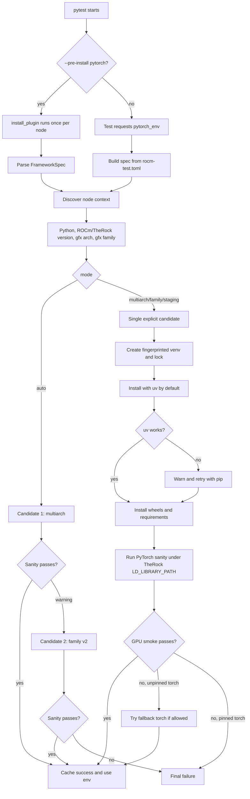

# PyTorch Provisioning

This document describes the ROCm PyTorch provisioning path used by `rocm-tests`.
It is intended for test authors and maintainers who need a reproducible PyTorch
environment on local or remote GPU nodes without importing PyTorch on the pytest
coordinator.

## Scope

PyTorch provisioning installs ROCm-enabled `torch`, `torchvision`, and
`torchaudio` wheels into a managed virtual environment on the execution node.
The same code path supports:

- Session-level pre-install via `--pre-install pytorch=...`.
- Lazy, fixture-driven install when a test first requests `pytorch_env`.
- Local, remote SSH, and xdist runs through the framework executor abstraction.
- Multi-arch wheels selected with `torch[device-gfxNNN]`.
- Family v2 wheels selected from a per-family index such as `gfx90a-dcgpu`.
- Pinned operator requests, where the requested package versions are installed
  exactly and no alternate `torch` fallback is attempted.

The provisioner is wheel-only. ROCm host installation remains the responsibility
of `--pre-install rocm=...`, CI setup, TheRock artifact installation, or the
operator-provided `--rock-dir`.

## Provisioning Entrypoints

### CLI Pre-Install

Use pre-install when a suite should provision PyTorch once before collection and
share the result across all dependent tests:

```bash
pytest tests/e2e/hipblaslt/test_hipblaslt_linear_shape_boundary.py \
  --remote-node host.yaml \
  --rock-dir=/home/mparamas/therock_build \
  --gpu-arch=gfx90a \
  --pre-install "pytorch=mode=auto"
```

Pre-install runs during `pytest_sessionstart`, before test collection. Results
are stored in `output/artifacts/pre-install/framework-provision-results.json`
and promoted into the fixture sanity cache on first fixture access.

### Test Fixtures

Use the fixtures when authoring tests. Do not import PyTorch on the coordinator
process.

```python
@pytest.mark.runtime.fast
def test_my_pytorch_workload(require_torch, torch_python, target_executor, ld_path):
    result = target_executor.run(
        f"env LD_LIBRARY_PATH={shlex.quote(ld_path['LD_LIBRARY_PATH'])} "
        f"{shlex.quote(torch_python)} my_workload.py"
    )
    assert result.ok, result.stderr
```

Fixtures provided from root `tests/conftest.py`:

- `pytorch_env`: returns the provision result (`ok=True`) with the managed Python path and metadata. Calls `pytest.fail` (not skip) if provisioning or sanity did not succeed.
- `torch_python`: returns the Python executable inside the managed venv.
- `require_torch`: calls `pytest.fail` if the `pytorch_env` result is not usable. Because `pytorch_env` itself already fails the test on an unusable environment, this fixture is a belt-and-suspenders guard for tests that only need the fixture side-effect.
- `require_torch_tunableop`: skips the test when the provisioned PyTorch build does not expose `torch.cuda.tunable`. Implies `require_torch`.

## CLI Install Options

The syntax is:

```bash
--pre-install "pytorch=key=value,key=value"
```

Supported keys:

| Key | Example | Intent |
| --- | --- | --- |
| `mode` | `auto`, `multiarch`, `family`, `staging` | Select the wheel channel strategy. Default is `auto`. |
| `device` / `gfx` | `gfx90a`, `gfx942` | Multi-arch device extra. Produces `torch[device-gfxNNN]`. |
| `gfx_family` / `family` | `gfx90a-dcgpu` | Family v2 index suffix override. Usually auto-detected. |
| `torch` | `2.14.0a0+rocm7.15.0a20260716` | Pin the exact `torch` version. Disables fallback to a different torch version. |
| `torchvision` | `0.29.0a0+rocm7.15.0a20260716` | Pin `torchvision`; otherwise version-matched from the selected `torch` ROCm build. |
| `torchaudio` | `2.11.0+rocm7.15.0a20260716` | Pin `torchaudio`; otherwise version-matched from the selected `torch` ROCm build. |
| `index` / `index_url` | `https://.../whl-multi-arch/` | Override the package index. Makes the request explicit and single-candidate. |
| `find_links` / `find_links_url` | `file:///.../wheels` | Add a local wheel source. Makes the request explicit and single-candidate. |
| `requirements` | `/path/a.txt:/path/b.txt` | Ancillary dependency files. Defaults to `[frameworks].requirements_pytorch`. |
| `pre` | `true`, `false` | Pass `--pre` to package version queries and installs. Default is `true`. |

Examples:

```bash
# Auto: try production multi-arch first, then family v2 if needed.
--pre-install "pytorch=mode=auto"

# Explicit multi-arch on the target GPU.
--pre-install "pytorch=mode=multiarch,device=gfx90a"

# Exact torch pin. Companion packages are auto-matched unless pinned too.
--pre-install "pytorch=mode=multiarch,device=gfx90a,torch=2.14.0a0+rocm7.15.0a20260716"

# Fully pinned package set. No fallback to another torch version.
--pre-install "pytorch=mode=multiarch,device=gfx90a,torch=2.14.0a0+rocm7.15.0a20260716,torchvision=0.29.0a0+rocm7.15.0a20260716,torchaudio=2.11.0+rocm7.15.0a20260716"

# Explicit family v2.
--pre-install "pytorch=mode=family,gfx_family=gfx90a-dcgpu"
```

## Mode Behavior

| Mode | Channel | Package Shape | Fallback Behavior |
| --- | --- | --- | --- |
| `auto` | `multiarch -> family` | First `torch[device-gfxNNN]`, then plain packages from family v2 | Intermediate failures are warnings. Final failure is reported only after candidates are exhausted. |
| `multiarch` | `[frameworks].multiarch_index` | `torch[device-gfxNNN]`, `torchvision[device-gfxNNN]`, `torchaudio` | Single candidate. Unpinned invalid-image wheels may try latest alternate torch; pinned torch does not fallback. |
| `family` | `[frameworks].family_index_base/<gfx_family>/` | Plain `torch`, `torchvision`, `torchaudio` | Single candidate. |
| `staging` | `[frameworks].staging_index` | Same package shape as multi-arch | Explicit opt-in only; never selected by `auto`. |

## Install Workflow



## Runtime Validation

Provisioning is successful only after sanity passes on the execution node. The
sanity check validates:

- `torch` imports.
- `torch.version.hip` is present.
- `torch.cuda.is_available()` is true.
- A real one-element GPU tensor operation succeeds.
- Optional `transformers.image_utils` imports if `transformers` is installed.
- The installed torch version matches an explicit `torch=` pin when provided.

When `--rock-dir` is supplied, sanity runs with:

```bash
LD_LIBRARY_PATH=<rock-dir>/lib
```

This matches workload execution and catches runtime-library or GPU code object
incompatibilities before tests run.

## Installer Selection

The managed venv is created with `python3 -m venv`. The provisioner then:

1. Upgrades `pip`, `wheel`, and `setuptools`.
2. Installs `uv` into the managed venv on the execution node.
3. Uses `uv pip install --python <venv-python>` for framework wheels and
   ancillary requirements.
4. Falls back to the equivalent `pip install` command if `uv` bootstrap,
   probing, or install fails.

`uv` is an accelerator, not a hard dependency. Logs include the selected
installer and package versions.

## Managed State and Artifacts

Provisioned environments live on the execution node under:

```text
~/run-rocm-tests/output/generated/framework-envs/<fingerprint>/
~/run-rocm-tests/output/generated/framework-locks/<fingerprint>.lock
```

Coordinator-visible logs and result metadata live under:

```text
output/artifacts/pre-install/<node-label>/pytorch-pre-install-<node-label>.log
output/artifacts/pre-install/framework-provision-results.json
```

The fingerprint includes the selected packages, Python version, ROCm version,
and gfx target. A validated env is reused when its metadata matches the current
request.

## File Map

| File | Need / Intent |
| --- | --- |
| `framework/plugins/install_plugin.py` | Implements `--pre-install` parsing, session-start fan-out across nodes, and shared pre-install result persistence. |
| `tests/conftest.py` | Exposes `pytorch_env`, `torch_python`, `require_torch`, and `require_torch_tunableop` fixtures to all tests. |
| `tests/common/ml_provisioning/fixtures.py` | Bridges pytest fixtures to the provisioner; handles sanity cache, pre-install result promotion, and lazy install retries. |
| `tests/common/ml_provisioning/spec.py` | Defines CLI/config spec parsing, supported modes, channel defaults, device extra normalization, and gfx-family mapping. |
| `tests/common/ml_provisioning/providers.py` | Defines PyTorch package names and the node-side sanity snippet. |
| `tests/common/ml_provisioning/provisioner.py` | Core provisioning engine: discovery, version selection, venv locking, uv/pip install, fallback handling, validation, and metadata. |
| `tests/common/ml_provisioning/workload.py` | `workload_failure_detail()` helper — produces diagnostic text for `hipErrorInvalidImage` failures in workload tests. |
| `tests/common/ml_provisioning/requirements-pytorch.txt` | Ancillary PyTorch ecosystem dependencies only; intentionally excludes `torch`, `torchvision`, and `torchaudio`. |
| `rocm-test.toml` | Source of truth for default mode, wheel index URLs, staging URL, and ancillary requirements path. |

## Test Author Guidance

- Use `require_torch` when the test needs a usable ROCm PyTorch runtime. The
  fixture calls `pytest.fail` (not skip) on an unusable environment — unusable
  PyTorch is a hard test failure, not a skip.
- Use `require_torch_tunableop` when the test additionally requires
  `torch.cuda.tunable`. This fixture skips (not fails) when TunableOp support
  is absent from the build, because absence is a build-configuration variant,
  not an error.
- Use `torch_python` to run workload scripts under the provisioned interpreter.
- Use `target_executor` for all GPU execution; never set `ROCR_VISIBLE_DEVICES`
  in test code.
- Pass `LD_LIBRARY_PATH` from the `ld_path` fixture when running against TheRock
  libraries.
- Avoid hardcoding package indexes or local paths in tests; use config or
  `--pre-install pytorch=...`.
- Pin versions only when the test requires an exact package set. Pinned `torch`
  disables fallback by design.

